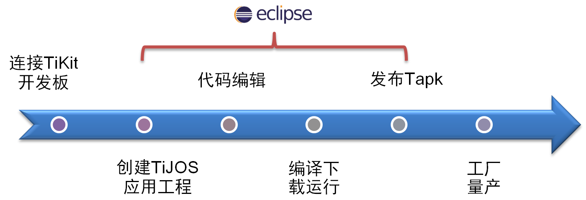

# 钛极OS(TiJOS)应用开发教程 Step by Step

## 概述

钛极OS是一个支持 Java 语言开发嵌入式智能硬件的物联网操作系统，支持大部分的Java特性，与标准Java兼容，并通过Eclipse进行开发，同时钛极OS还支持多应用。它的实现机制更像安卓、由内核掌管底层硬件资源，软硬隔离，同时集成高效的Java虚拟机，通过对硬件抽象，异步IO, 多线程、沙盒运行，事件驱动以及面向对象的Java语言开发等多种技术，使物联网硬件应用开发变得轻松且高效。

整个开发过程与标准Java应用开发过程类似，具有基本Java开发经验即可开发硬件应用, 开发过程如下图所示:

## 开发前准备工作：

### 1、开发平台支持最低要求

Windows 7及以上。

### 2、安装Eclipse

Eclipse可在[http://www.eclipse.org/downloads/](http://www.eclipse.org/downloads/)下载，如果已经安装请跳过；Eclipse版本支持：4.6 及以上。

### 3、安装钛极OS的开发工具TiStudio插件

TiStudio插件必须在Eclipse上在线安装，安装方式参见文档[TiStudio插件安装方法](../tijos-setup/tijos_application_devsuite_setup.md)。

### 4、钛极OS开发套件

建议用户先购买我公司钛极小龟物联网开发套件系列,详细介绍: [钛极小龟物联网开发套件系列](../tikit/tijos_docs_tikit.md)

淘宝搜索TiJOS即可[购买](https://shop423269048.taobao.com/)

每个套件中都包含了完整的应用开发教程, 方便用户快速熟悉钛极OS的开发模式。

### 5、学习钛极OS的开发

新用户可以按照开发套件中提供的教程在硬件上运行每个例子，通过学习来了解钛极OS的编程方法、下载方法、串口打印调试、异常信息处理等。

### 6、深入学习钛极OS开发

在完成基本例程的尝试后，用户仔细研究钛极OS的[**文档中心**](http://doc.tijos.net/)，了解钛极OS支持的API信息，尝试着按照自己的思路来实现硬件功能。

### 7、钛极驱动中心

用户在做一件硬件产品设计时，除了主处理器CPU，还需要使用各类硬件模块来实现产品功能，用户可以先到**钛极驱动中心**查看一下是否有该模块或者类似模块的驱动、例程和源码，可以直接使用或者移植后使用。
