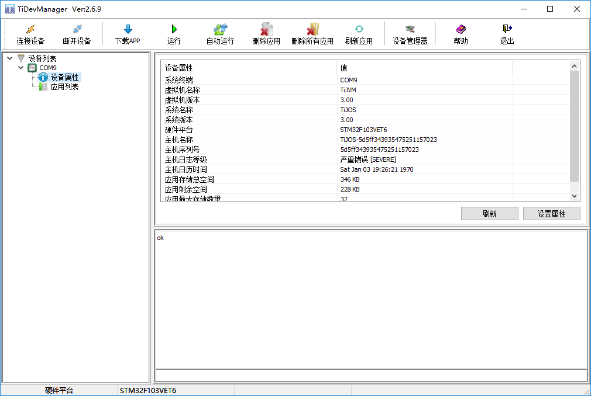

# 钛极OS(TiJOS)应用开发环境-TiStudio

钛极OS(TiJOS)应用开发环境只需在Eclipse中在线安装TiStudio插件即可，安装成功后即可在Eclipse中进行TiJOS应用的开发和运行，Eclipse中TiStudio插件安装路径http://dev.tijos.net/studio/release, 按Eclipse标准插件安装流程进行安装即可。具体过程如下：

## 开发平台支持

最低要求：Windows 7及以上

## 安装Eclipse

TiJOS应用与标准Java 应用类似，通过在Eclipse中安装TiStudio插件即可通过Eclipse进行TiJOS应用的开发和调试，Eclipse可在http://www.eclipse.org/downloads/ 下载。

如果您已安装Eclipses, 可直接安装TiStuido即可。

Eclipse版本支持：4.6 及以上

## TiStudio安装

在Eclipse中通过Help菜单下的"Install New Software" 安装TiStuido 插件, 安装过程如下:

1. 从Eclipse菜单"Help"下选择"Install New Software"

   

2. 从弹出的Install对话框中选择"Add"按钮后弹出“Add Repository"后，填写TiStudio的插件url http://dev.tijos.net/studio/release 名称任意

   

   Add Repository

   

3. 从显示出的"Available Software"中选择"TiJOS"下的"TiStudio Release"后， 点击"Next"按钮开始进行安装

   

4. 选择"I accept the terms of the license agreement" 后点击"Finish"即可完成安装

   

Installing...

   

## TiStudio 主要功能

### TiStudio 菜单

TiStudio安装完成后重新启动Eclipse之后，Eclipse的菜单中增加了"TiJOS"即为TiStuido相关功能

#### 菜单项 - TiDevManager

运行TiDevManager设备管理器,  当需要对TiKit开发板进行设置时可通过该菜单项操作

#### 菜单项 - Exception Query

异常查询， 如果用户应用中发生异常通过打印口或其它方式输出时，可使用该功能对异常进行分析和定位。

#### 菜单项 - Document Center

文档资源中心， 可在线查看相关文档

### TiDevManager设备管理器

通过TiJOS菜单下的TiDevManager 即可开启设备管理器, 连接TiKit开发板后， TiKit开发板相关信息即可自动显示在设备管理器中， 在TiDevManager可进行设备信息查看，运行日志查看，设备属性配置等功能 ，如果是网络应用，还可在TiDevManager中配置网络设置，如无线WIFI， 网关，DNS等等， 在开发过程中可根据需求连接相关的传感器进行开发和测试。

如果设备连接成功，在TiDevManager中可以看到当前连接的设备， TiStudio 使用检查到的第一个设备进行应用下载，运行测试。

### 新建TiJOS应用工程

在新建工程时选择“Other” 时， 即可看到TiJOS Application Project的选项

   

当新建TiJOS Application Project后，即可在Eclipse中进行代码编写。

### 编译运行TiJOS应用

 完成编码后， 可在TiKit开发板上进行测试运行， 可右键选择"Run As  TiJOS Application" 在TiKit开发板上运行

   

### 查看应用日志

应用在运行时， 相应的日志会通过TiJOS LogCat 窗口输出

### 版本更新

当TiStudio 有新版本更新时也通过Eclipse提示并在线进行更新， 建议用户保持新版本。

## 总结

TiStudio 是进行钛极OS(TiJOS)应用开发的集成平台，也是一个标准Eclipse插件，与标准Java应用开发过程类似，只要熟悉Eclipse即可轻松上手TiJOS应用开发。