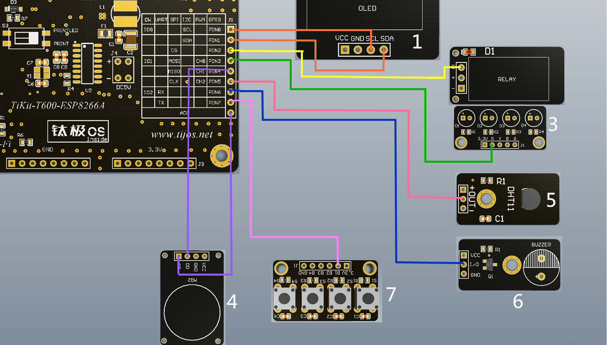

# 可燃气体监测仪例程

## 简介

可燃气体，主要包含甲烷、乙烷等烷类气体以及酒精、汽油等可燃液体挥发后形成的气体，即在常温气体状态下可以被点燃的气体，可统称为可燃气体。随着清洁能源的广泛普及，以天然气（主要成分为甲烷）为代表的清洁可燃气体被广泛用于家庭厨房、即热热水器以及暖气取暖等多种场景中。其价格低廉、无污染等特点受到了一致好评。但是，在可燃气体的使用中，存在着泄露、燃烧不完全等多种可能，使得家庭空气中的可燃气体浓度急剧升高，当浓度到达一定程度时，燃气中毒、遇火爆炸等危险情况时有发生。因此，可燃气体的安全监测尤为重要。

本例程提供了一种带有实时环境状态监测以及显示的可燃气体监测报警仪， 例程中主要使用套件中的TiKit-T600-ESP8266A 主开发板以及以下模块：

1. 屏幕显示部分：TiOLED_UG2864 OLED显示模块；
2. 电器供电控制部分：TiRelay 继电器模块；
3. 灯光报警部分：TiLED 灯模块；
4. 可燃气体浓度监测部分：TiMQ2可燃气体浓度监测模块；
5. 温湿度监测部分：TiDHT 温湿度监测模块；
6. 声音提示部分：TiBuzzer 蜂鸣器模块；
7. 按钮部分：TiButton 按键模块；

通过使用相应的的驱动包即相关总线类，加以逻辑设计，可燃气体监测仪主要实现以下功能

1. 温湿度实时监测、显示；

2. 可燃气体浓度监测、蜂鸣器报警、红灯闪烁报警；

3. 报警后自动断电、警报解除后自动恢复供电（使用继电器模拟场景）；

4. 按钮消声，解除声音报警，保留屏幕提示和灯光报警；

5. 屏幕实时当前温湿度信息以及报警状态。

本例程可用于家庭可燃气体浓度监测及报警，开发者可根据实际需求自行扩展，例如：

1. 接入网络实现远程监控及自动报警功能；

2. 更换工业级的高精度传感器·，可用于厂房安全、井下安全等多种高危场景；

3. 加以火焰监测、高温监测等传感器，可用于楼宇消防安全。

目录如下：

- GasMonitoringSample

## 适用TiKit开发板 

1.TiKit-T600-ESP8266A

## TiKit-T600-ESP8266A 连接说明 - GasMonitoringSample

### 电气连接

1. 屏幕显示部分：TiOLED_UG2864
   - 3.3V<------>VCC
   - GND<------>GND
   - SDA<------>SDA
   - SCL<------>SCL
2. 电器供电控制部分：TiRelay
   - DC5V（+）<------>（+）电源
   - DC5V（-）<-------->（-）地
   - PIN2<------>（S）信号线
3. 灯光报警部分：TiLED
   - 3.3V<------>3.3V
   - PIN3<------>R(红色灯)
4. 可燃气体浓度监测部分：TiMQ2
   - DC5V（+）<------>VCC
   - DC5V（-） <------->GND
   - ADC <------->AO
   - PIN4<-------->DO
5. 温湿度监测部分：TiDHT
   - GND<------>地（-）
   - PIN5  <------>信号线（OUT）
   - 3.3v <------>电源（+）
6. 声音提示部分：TiBuzzer
   - GND<------>GND
   - PIN6<------>I/O
   - 3.3v <------>VCC
7. 按钮部分：TiButton
   - GND<------>GND
   - PIN7<------>B1(S1)

### 示意图

### 注意事项

1. 为了避免图中线条太多对用户阅读造成干扰，因此在上述示意图中，各部分与TiKit只连接了信号线，未将VCC和GND与各部分相连。用户在实际测试时，各部分的VCC（-）和GND（-）都需要依照**电气连接**部分的对照表一一对应连接。
2. 使用本例程时，由于各部分均与主板连接，因此需要格外注意模块的焊接点互相碰到，否则容易造成短路，烧毁器件。建议用户在使用时，将各部分的连接线整理好，将模块尽量隔离。
3. TiMQ2在使用时会有发热现象，属于正常现象。