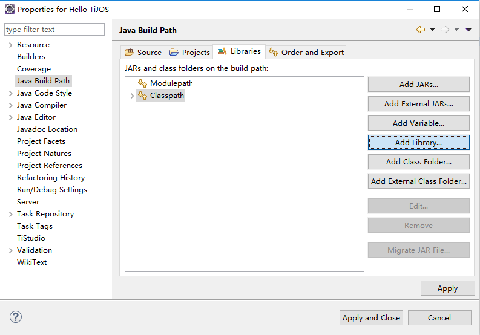
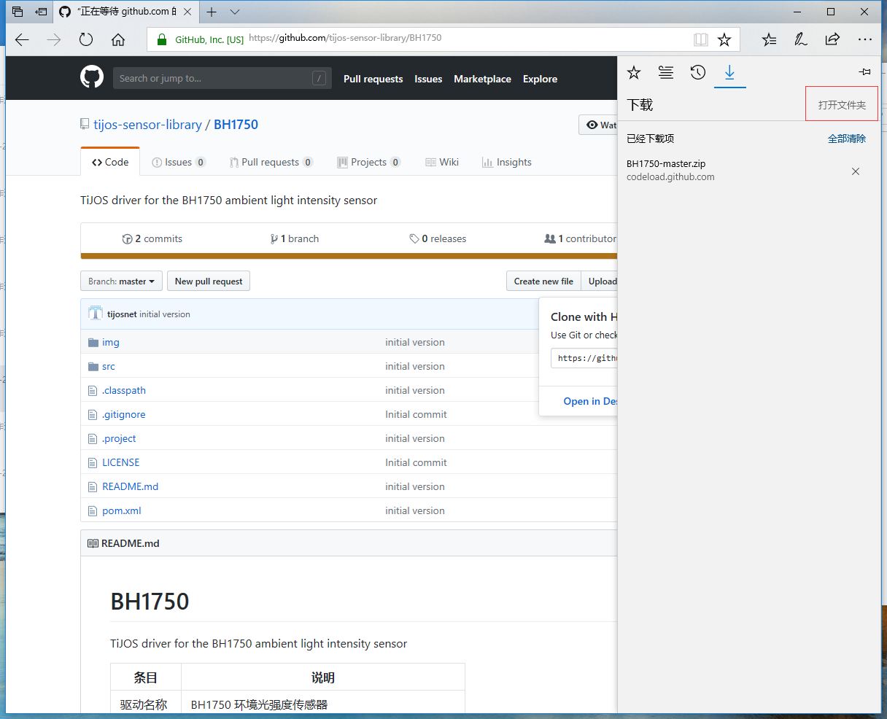
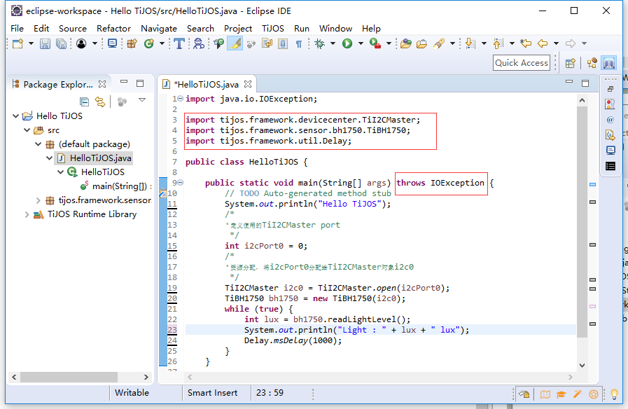

# 钛极OS(TiJOS)传感器驱动 #

钛极OS(TiJOS)通过驱动仓库提供了各种开源的传感器驱动源码, 方使用参考和使用。 同时将其中一部分典型驱动做为标准库允许用户在TiStudio中直接加入引用。
标准加中包含了10种基本传感器，相关源码也可通过驱动仓库获得， 这些传感器包括

| 传感器模块名称                                          | Java Class                                     |
| ------------------------------------------------------- | ---------------------------------------------- |
| 按键模块            | tijos.framework.sensor.button.TiButton         |
| LED灯模块          | tijos.framework.transducer.led.TiLED           |
| 三基色灯模块       | tijos.framework.transducer.led.TiRGBLED        |
| OLED12864显示模块  | tijos.framework.transducer.oled.TiOLED_UG2864  |
| 单通道继电器模块 | tijos.framework.transducer.relay.TiRelay1CH    |
| 可燃气体浓度检测模块    | tijos.framework.sensor.mq.TiMQ                 |
| 数字温湿度采集模块     | tijos.framework.sensor.dht.TiDHT               |
| 数字温度采集模块   | tijos.framework.sensor.ds18b20.TiDS18B20       |
| 有源蜂鸣器模块  | tijos.framework.transducer.buzzer.TiBuzzer     |
| 红外接收模块       | tijos.framework.sensor.vs1838b.TiVS1838BNEC    |
| 超声波测距模块        | tijos.framework.sensor.hscr.TiHSCR04           |
| 通用传感器         | tijos.framework.sensor.general.TiGeneralSensor |

在应用当中可通过在工程中添加标准库支持来直接使用相关驱动

##标准库添加

　　新建工程没有带标准库，如果使用标准库，需要自己动手添加，添加过程如下：

　　选中Hello TiJOS工程右击，点击Properties（也可以用快捷键）。

　　选Java Build Path里的Classpath,点击Add Library。

　　选TiJOS Driver Library Classpath Container,点击Next。

　　选中TiJOS Driver Library,点击Finish。

　　点击Apply and Close。

　　如下图所示，标准库添加成功。

## 驱动仓库及源码 ##

钛极TiJOS驱动仓库是通过自行开发、模块厂商、开发者支持等多种方式共同构的建覆盖广泛的软件仓库，它是一个开放的平台，由经过测试的传感器驱动、通讯模组驱动、网络协议和应用组件等常用功能组件构成，可帮助开发者快速实现各种软硬件扩展功能，减少开发编码工作量，让物联网开发不再从零做起，像搭积木一样简单，加速应用程序上市速度。

钛极OS(TiJOS)驱动仓库支持常见传感器及模块，并在不断持续增加, 对于不支持的传感器，用户可提出申请或者基于设备总线类也可进行开发。

 **[进入钛极(TiJOS)驱动仓库](http://store.tijos.net)**

驱动仓库中包含对传感器的描述及相关的源码链接， 源码均可在github找到并免费下载，库里都是可执行性程序，每个库里都包含一个驱动，一个例程，建议用户通过钛极驱动仓库找到所需传感器点击源码导航到github相关链接或通过如下方式进入直接查看。

下载地址：https://github.com/tijos-sensor-library

　　**下载过程如下：**

　　打开网址链接，如下图。

　　点击Download ZIP下载。

　　下载完成后，点击打开文件。

　　文件是个压缩包，如下图所示：

　　解压文件，并记住解压路径。

## 三、工程移植 ##

　　下载下来的库文件都是完整的工程，如果您已安装mvn, 可通过mvn eclipse:eclipse 命令行生成eclipse工程并导入运行，或者直接将源码加入到您的工程中进行运行

　　驱动包可以直接用鼠标拖入工程。

　　弹出如下对话框，点击OK。

　　驱动包已成功导入工程。

## 四、程序纠正 ##

　　驱动的导入后，程序可以直接写，不用考虑少驱动文件。出现错误不用担心，把光标拖到错误出会弹出改正方法。

　　点加入头文件，如下图，其他错误同理。

　　软件自动更正错误。

