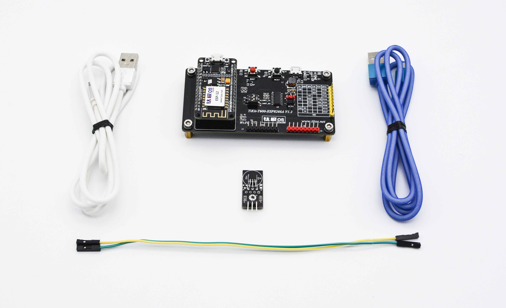
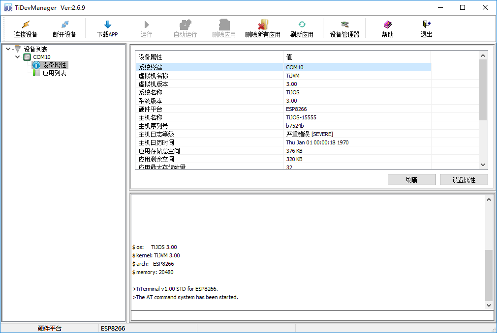
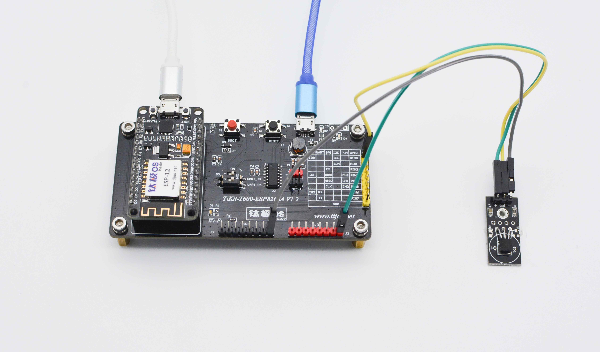
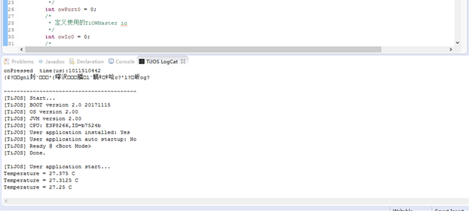

# 感知世界的温暖-温度采集

例程说明：监测当前环境温度。

## 第一步： 环境搭建

### 1. 软件环境

请参考《钛极OS(TiJOS)应用开发环境搭建》以及《HelloWorld 第一个钛极OS(TiJOS)应用》搭建环境并创建例程：DS18B20Sample。

### 2. 硬件环境

例程所需（以TiKit-T600-ESP8266A开发套件为例）：

1. TiKit-T600-ESP8266A开发板；
2. TiDS18B20模块；
3. 杜邦线3根；
4. USB线2根；



使用USB线分别将 TiKit-T600-ESP8266A开发板的两个USB口连接到电脑的USB端口，并使用TiDevManager查看主板的连接是否正常。当开发板和电脑连接成功后，按下开发板上的Reset键，日志窗口会将当前开发板的BOOT信息打印出来，如下图所示。



注意：为确保TiDevManager正常识别开发板，请将PC端的串口操作软件关闭，否则可能造成TiDevManager不能正常识别开发板。

## 第二步：例程设计

### 1. 硬件连接

所需硬件资源：TiOWMaster的IO0。

将TiDS18B20用杜邦线连接到TiKit-T600-ESP8266A开发板：

- GND<------>地（-）
- IO0  <------>信号线（OUT）
- 3.3v <------>电源（+）



### 2. 例程编写

在之前创建的工程DS18B20Sample中新建DS18B20.java文件，并引入以下包：

```java
import java.io.IOException;
import tijos.framework.devicecenter.TiOWMaster;
import tijos.framework.sensor.ds18b20.TiDS18B20;
import tijos.util.Delay;
```

首先在主类DS18B20中定义main方法，并定义所需要使用的TiOWMaster port以及所需要使用的IO（按照硬件设计所连接的IO编号）。然后创建TiOWMaster 对象ow0并打开需要使用的owIo编号。最后再创建TiDS18B20对象ds18b20并将ow0和owIo0与其绑定。

```java
public class DS18B20 {
	/**
	 * 程序入口，由TiJOS调用
	 * @param args 入口参数， TiJOS中一直等于null
	 */
	public static void main(String[] args) {
      	try {
          /*
           * 定义使用的TiOWMaster port
           */
          int owPort0 = 0;
          /*
           * 定义使用的TiOWMaster io
           */
          int owIo0 = 0;
          /*
           * 资源分配，
           * 将owPort0与owIo0分配给TiOWMaster的对象ow0
           */			
          TiOWMaster ow0 = TiOWMaster.open(owPort0, owIo0);
          /*
           * 资源绑定，
           * 创建TiDS18B20对象ds18b20并将ow0和owIo0与其绑定
           */	
          TiDS18B20 ds18b20 = new TiDS18B20(ow0, owIo0);
```

按照上述步骤将资源分配完成后，就可以使用ds18b20的selectSingle方法，选择外挂单个传感器模式。在循环中使用ds18b20的measure方法每隔1秒（1000ms）测量一次温度，然后通过getTemperature方法获取最近一次测量到的环境温度值并通过打印端口输出。

```java
            /*
            * 资源使用，
            * 选择只有单传感器模式
            * 启动测量并获取温度数据
            */
			ds18b20.selectSingle();
              while (true) {
                try {
                  ds18b20.measure();
                  double temperature = ds18b20.getTemperature();
                  System.out.println("Temperature = " + temperature + " C");

                } catch (IOException e1) {
                  e1.printStackTrace();
                }

                Delay.msDelay(1000);
			}
		} catch (IOException ex) {
			ex.printStackTrace();
		}
	}
}
```

完整例程代码可参考《TiDS18B20数字温度传感器功能例程》。

## 第三步：结果演示

将上述例程按照《HelloWorld 第一个钛极OS(TiJOS)应用》中的方法编译并运行，即可在硬件上实现环境温度测量的功能演示。

## 源码

请参考[DS18B20.java](./src/DS18B20.java)