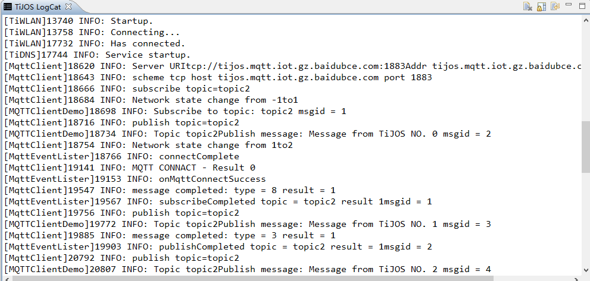

# 万物互联-物联网之MQTT

MQTT是物联网系统中使用最广泛的通讯协议， 已被所有的物联云所支持， 钛极OS(TiJOS) 提供了MQTT相关Java类，可直接支持设备连接至各大物联云平台。

下面以百度云为例，在使用前请先在百度云下的物接入IoT Hub中进行相关配置，具体请参考

https://cloud.baidu.com/product/iot.html


## 网络配置

在进行网络应用开发之前，请先通过TiDevManager对TiKit 进行网络设置


## 百度云IoT Hub设置

在百度云Iot Hub进行设置后获得如下类似信息:

| 参数              | 值                                        | 说明                        |
| --------------- | ---------------------------------------- | ------------------------- |
| MQTT Server URI | tcp://tijos.mqtt.iot.gz.baidubce.com:1883 | MQTT 服务器地址及端口             |
| User Name       | tijos/dev1                               | 设备用户名                     |
| Password        | tWnuCZdmdgqn6uT6oaVjE1NwC9atipvOTxBA0Xn2QFQ= | 用户密码                      |
| Topic           | topic2                                   | 用于发布和订阅的主题名，需要同时具有发布和订阅权限 |

以上配置为例程中所用的配置， 可根据实际应用进行对应修改。

## 新建 TiJOS Application 应用工程

在TiStudio中新建MQTTClientDemo工程及相应的类

## 启动网络连接

在应用中使用网络之前， 首先需要启动网络连接

```java
try{
//启动WLAN及DNS
TiWiFi.getInstance().startup(10);
TiDNS.getInstance().startup();
}
catch(IOException ex)
{
ex.printStackTrace();
return ;
}
```

## MQTT server连接参数设置

根据以上参数设置MQTT server的连接参数

```java
//MQTT Server 地址,用户名, 密码 
final String broker       = "tcp://tijos.mqtt.iot.gz.baidubce.com:1883";
final String username     = "tijos/dev1";
final String password     = "tWnuCZdmdgqn6uT6oaVjE1NwC9atipvOTxBA0Xn2QFQ=";

//ClientID
final String clientId     = "mqtt_test_java_tijos";

//MQTT连接设置
MqttConnectOptions connOpts = new MqttConnectOptions();
connOpts.setUserName(username);
connOpts.setPassword(password);
//允许自动重新连接
connOpts.setAutomaticReconnect(true);
```

## 设置MQTT事件回调并连接MQTT服务器

MQTT通过事件回调的方式提供服务，需要创建一个MqttClientListner的实现类用于接收事件回调

```java
class MqttEventLister implements MqttClientListener
```
设置回调参数

```
mqttClient.SetMqttClientListener(new MqttEventLister());
//连接MQTT服务器
mqttClient.connect(connOpts, mqttClient);
```

## 订阅主题 

订阅指定主题，当收到订阅主题的数据发布时， MqttClientListener的messageArrived事件将被调用

```
//订阅topic
int qos = 1;
String topic        = "topic2";
int msgId = mqttClient.subscribe(topic, qos);
```

## 发布数据到指定主题

publish用于将数据发布到指定主题

```
  
String content = "new data";
msgId = mqttClient.publish(topic, content.getBytes(), qos, false);

```


## 关闭并释放资源

应用结束前或不再使用MQTT时，请关闭MQTT 连接


## 结果输出

可在TiDevManager中将日志配置为显示全部以查看输出结果，编译下载后在TiKit上运行如下图所示：




相关源码请参考[MqttClientDemo.java](./src/MqttClientDemo.java)

## 结论

钛极OS(TiJOS) MQTT编程与目前广泛流行开源Paho MQTT编程方式相似，可以方便将现有的MQTT 应用移植到钛极OS(TiJOS)中运行， 与各大物联云集成非常方便。

