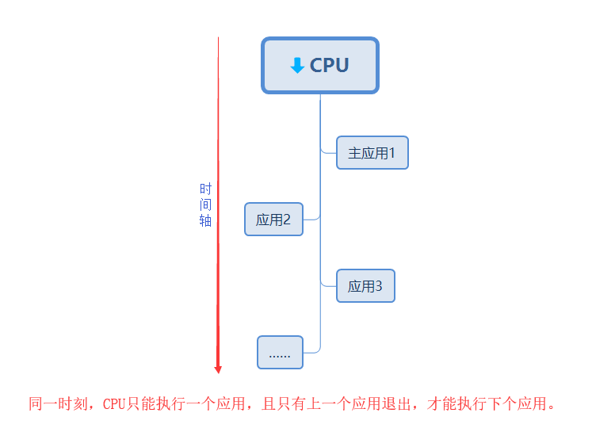

# 认识多应用，一机多用与应用间调用 #

## 温馨提示 ##

- 本课提到的应用和JAVA语言里进程不是一个概念，请读者不要混淆。
- 多应用为公司独有技术，在此不涉及参考资料，资料以本教案为主。

## 第一节、简介 ##

　　大部分操作系统都支持运行多个任务，通常一个任务就是一个程序，而一个完整的程序可以理解为是一个应用。     
　　本操作系统支持运行多个应用，但不能多个应用同时运行，前个应用必须退出才能运行下个应用。
 
　　应用特性：          
　　1：独立性：应用是系统中独立存在的实体，它可以独立拥有资源，每一个应用都有自己独立的地址空间，没有应用本身的运行，用户应用不可以直接访问其他应用的地址空间。             
　　2：动态性：应用和程序的区别在于应用是动态的，应用中有时间的概念，应用具有自己的生命周期和各种不同的状态。           

## 第二节、多应用形态 ##
　　           
　　最大支持32个应:           
　　1.应用之间可相互启动。         
　　2.应用启动时支持参数设置，并可设置上电自动运行。             
　　3.应用支持安装、卸载、运行。 

　　CPU同一时刻只能执行一个应用，上一个应用只有一个下个应用的入口，上个执行完退出才执行下个应用。                

　　优点：成功的解决程序冗余的问题，优化CPU资源，让CPU运行更加流畅和快速。

## 第三节、应用场景 ##

　　典型应用场景1:OTA            
　　1.将OTA功能独立为一个应用。               
　　2.当需要OTA时启动OTA应用进行应用更新即可。                    
　　优点 OTA过程不影响正常业务流程 OTA按需启动，不占用系统资源，OTA应用可由专人开发。 
        
　　典型应用场景2:同一硬件多种配置                        
　　内置多种配置应用 根据不同配置启动对应的应用即可。                    
　　优点 支持用户根据实际情况进行功能配置 可根据外设不同进行应用选择 可根据配置不同启动对应的应用，如连接不同的云平台。

## 第四节、代码讲解 ##

应用1： 

	/**
	 * 认识多应用，一机多用与应用间调用，应用程序1
	 * 
	 * @author tijos
	 *
	 */
	public class APP1 {
	
		public static void main(String[] args) {
			System.out.println("Hi, i am APP1:");
			for (int i = 0; i < args.length; i++) {
				System.out.println(args[i]);
			}
		}
	
	}

应用2：
	
	/**
	 * 认识多应用，一机多用与应用间调用，应用程序2
	 * 
	 * @author tijos
	 *
	 */
	public class APP2 {
	
		public static void main(String[] args) {
			System.out.println("Hi, i am APP2:");
			for (int i = 0; i < args.length; i++) {
				System.out.println(args[i]);
			}
		}
	
	}

主应用：

	import java.io.IOException;
	
	import tijos.framework.appcenter.TiAPP;
	import tijos.framework.appcenter.TiAPPManager;
	
	/**
	 * 认识多应用，一机多用与应用间调用，主应用程序
	 * 
	 * @author tijos
	 *
	 */
	public class mainAPP {
	
		public static void main(String[] args) {
			// 获取应用管理器实例
			TiAPPManager mgr = TiAPPManager.getInstance();
			try {
				TiAPP app = null;
				// 枚举因应用列表
				TiAPP[] list = mgr.enumerate();
				// 循环打印应用ID和应用名字
				for (int i = 0; i < list.length; i++) {
					System.out.println("APP ID:" + list[i].getId() + "  APP name:" + list[i].getName());
					// 如果找到名字为APP1的应用，保存应用实例
					if (list[i].getName().equals("lesson1-APP1")) {
						app = list[i];
					}
				}
				// 已经找APP1，立即执行APP1，当前应用退出
				if (app != null) {
					app.execute(true, "P1 P2 P3 P4");
				}
			} catch (IOException e) {
				e.printStackTrace();
			}
		}
	
	}

   
## 第五节、实验现象 ##

打印出检索到的所有应用ID和应用名字，如果找到预设置的应用名称则退出当前的应用，执行新的应用。

