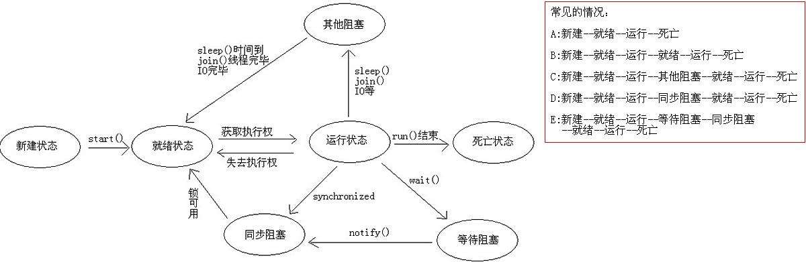

# 认识多线程，声控灯与温湿度采集 #

## 温馨提示 ##

- 线程：同一类线程共享代码和数据空间，每个线程有独立的运行栈和程序计数器(PC)，线程切换开销小。（线程是cpu调度的最小单位）
- 钛极OS(TiJOS)支持Java中标准的线程Thread和Runnable, 符合Java标准。
- 线程可以大大简化许多类型的应用程序开发，但过度使用线程可能会影响程序的性能及其可维护性， 一般建议用在不阻塞整个程序的情况下执行阻塞I/O, 如等待网络数据等等。
- 钛极OS(TiJOS)中的线程与Java标准兼容， 因此只需参考Java中Thread 和Runable类编程方式即可快速应用。 

## 第一节、简介 ##

　　Java编写程序都运行在Java虚拟机（JVM）中，在JVM的内部，程序的多任务是通过线程来实现的。每用java命令启动一个java应用程序，就会启动一个JVM进程。在同一个JVM进程中，有且只有一个进程，就是它自己。在这个JVM环境中，所有程序代码的运行都是以线程来运行。

　　一般常见的Java应用程序都是单线程的。比如，用java命令运行一个最简单的HelloWorld的Java应用程序时，就启动了一个JVM进程，JVM找到程序程序的入口点main()，然后运行main()方法，这样就产生了一个线程，这个线程称之为主线程。当main方法结束后，主线程运行完成。JVM进程也随即退出 。

　　对于一个进程中的多个线程来说，多个线程共享进程的内存块，当有新的线程产生的时候，操作系统不分配新的内存，而是让新线程共享原有的进程块的内存。因此，线程间的通信很容易，速度也很快。不同的进程因为处于不同的内存块，因此进程之间的通信相对困难。

　　进程是指一个内存中运行的应用程序，每个进程都有自己独立的一块内存空间，一个进程中可以启动多个线程。比如在Windows系统中，一个运行的exe就是一个进程。  

　　线程是指进程中的一个执行流程，一个进程可以运行多个线程。比如java.exe进程可以运行很多线程。线程总是输入某个进程，进程中的多个线程共享进程的内存。

　　Java中线程是指java.lang.Thread类的一个实例或线程的执行。使用java.lang.Thread或java.lang.Runnable接口编写代码定义、实例化、启动新线程。

　　Java中每个线程都有一个调用栈，即使不在程序中创建任何新的线程，线程也在后台运行。main()方法运行在一个线程内，称为主线程。一旦创建一个新的线程，就产生一个新的调用栈。

   
## 第二节、运行状态 ##
                  
　　线程优先极：                                                    
　　建议所有线程使用默认优先级，否则有可能导致低优先级的线程没有机会执行。

　　线程状态转换：          
　　线程分为五个阶段：创建、就绪、运行、阻塞、终止（死亡）。

## 第三节、代码讲解 ##

	import java.io.IOException;
	
	import tijos.framework.devicecenter.TiADC;
	import tijos.framework.devicecenter.TiGPIO;
	import tijos.framework.sensor.dht.TiDHT;
	import tijos.framework.transducer.relay.TiRelay1CH;
	import tijos.framework.util.Delay;
	
	/**
	 * 声控灯线程
	 * 
	 * @author tijos
	 *
	 */
	class LightThread extends Thread {
	
		TiGPIO _gpio;
		int _ctlPin;
		TiADC _adc;
		int _inChl;
	
		/**
		 * 构造
		 * 
		 * @param gpio
		 * @param ctlPin
		 * @param adc
		 * @param inChl
		 */
		public LightThread(TiGPIO gpio, int ctlPin, TiADC adc, int inChl) {
			this._gpio = gpio;
			this._ctlPin = ctlPin;
			this._adc = adc;
			this._inChl = inChl;
		}
	
		public void run() {
	
			System.out.println("LightThread running...");
	
			try {
				// GPIO总线资源与继电器对象绑定
				TiRelay1CH relay = new TiRelay1CH(this._gpio, this._ctlPin);
				// 设置ADC参考电压1.0V，外部2倍分压
				this._adc.setRefVoltageValue(1.0, 2);
				// 定义采集电压比较阈值为：14.0毫伏
				double threshold = 14.0;
				// 循环检测
				while (true) {
					// 检测到按钮按下
					if (this._adc.getVoltageValue(this._inChl) * 1000 > threshold) {
						// 打开继电器
						relay.turnOn();
						// 延时10秒
						Delay.msDelay(10 * 1000);
					} else {
						// 关闭继电器
						relay.turnOff();
					}
					// 检测间隔100ms
					Delay.msDelay(100);
				}
			} catch (IOException e) {
				e.printStackTrace();
			}
		}
	}
	
	/**
	 * 温湿度采集线程
	 * 
	 * @author tijos
	 *
	 */
	class HumitureThread extends Thread {
	
		TiGPIO _gpio;
		int _dataPin;
	
		/**
		 * 构造
		 * 
		 * @param gpio
		 * @param dataPin
		 */
		public HumitureThread(TiGPIO gpio, int dataPin) {
			this._gpio = gpio;
			this._dataPin = dataPin;
		}
	
		public void run() {
	
			System.out.println("HumitureThread running...");
	
			try {
				// 创建温湿度传感器对象
				TiDHT dht11 = new TiDHT(this._gpio, this._dataPin);
				while (true) {
					// 启动测量
					dht11.measure();
					// 结果打印
					System.out.println("TEMP: " + dht11.getTemperature() + "  C");
					System.out.println("HUMI: " + dht11.getHumidity() + "  %");
					// 延时2秒
					Delay.msDelay(2000);
				}
			} catch (IOException e) {
				e.printStackTrace();
			}
		}
	}
	
	/**
	 * 认识多线程，声控灯与温湿度采集
	 * 
	 * @author tijos
	 *
	 */
	public class Multithreading {
	
		public static void main(String[] args) {
	
			TiGPIO gpio0 = null;
			TiADC adc0 = null;
			try {
				// GPIO资源分配，GPIO0的PIN2和PIN3脚
				gpio0 = TiGPIO.open(0, 2, 3);
				// ADC资源分配，ADC0的CH0通道
				adc0 = TiADC.open(0, 0);
			} catch (IOException e) {
				e.printStackTrace();
			}
			// 创建声控灯线程对象
			LightThread thread1 = new LightThread(gpio0, 2, adc0, 0);
			// 创建温湿度采集线程对象
			HumitureThread thread2 = new HumitureThread(gpio0, 3);
			// 启动两个线程
			thread1.start();
			thread2.start();
			// 当前线程退出
			System.out.println("MainThread exit.");
		}
	}

## 第四节、实验现象 ##

声控灯与温湿度计迸发运行，各自占一个线程。

## 第五节、参考资料 ##

JAVA多线程详解：https://www.cnblogs.com/yjd_hycf_space/p/7526608.html              
JAVA多线程详解：http://www.runoob.com/java/java-multithreading.html                      
进程详解：https://blog.csdn.net/m________123/article/details/79686246

