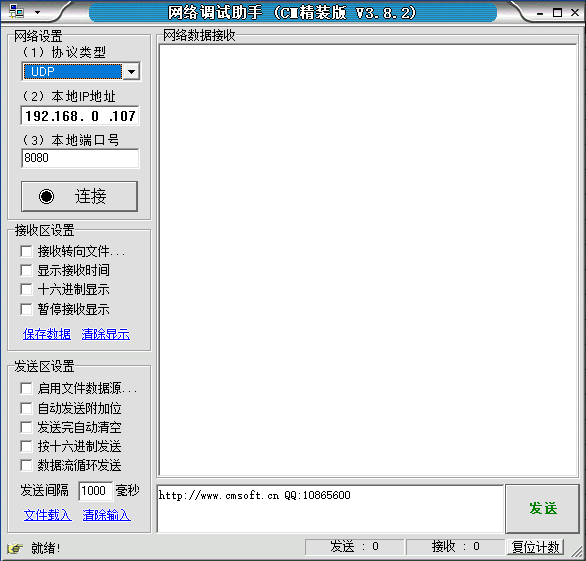
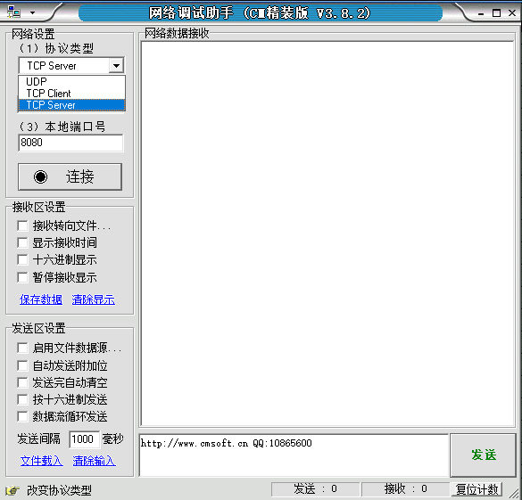
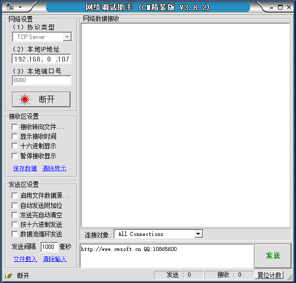
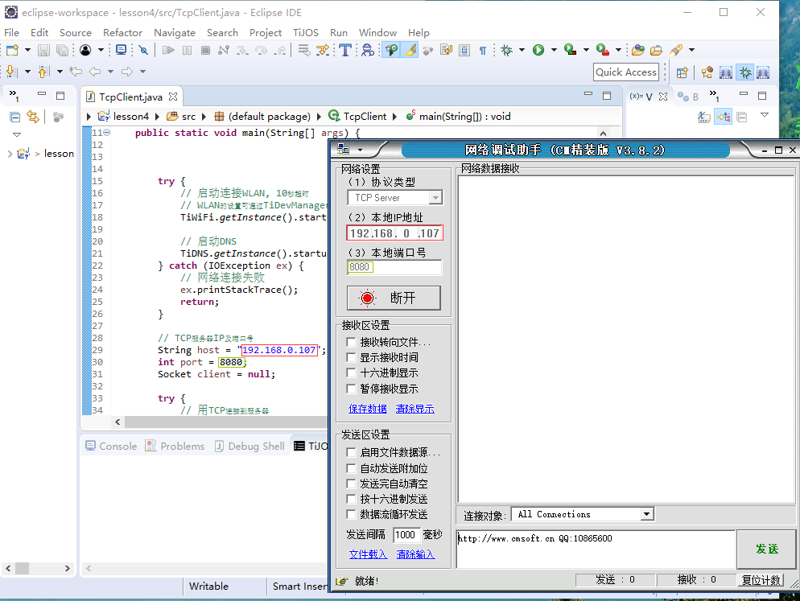
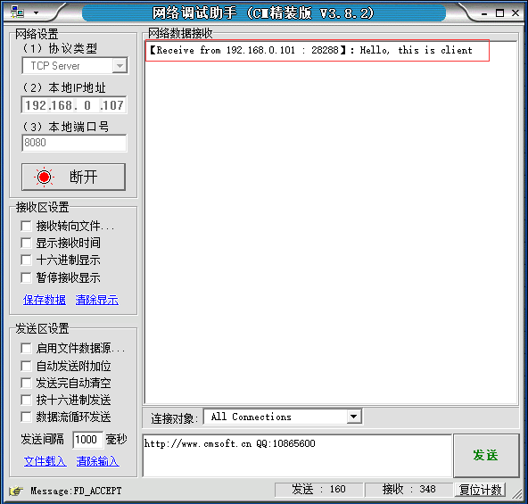
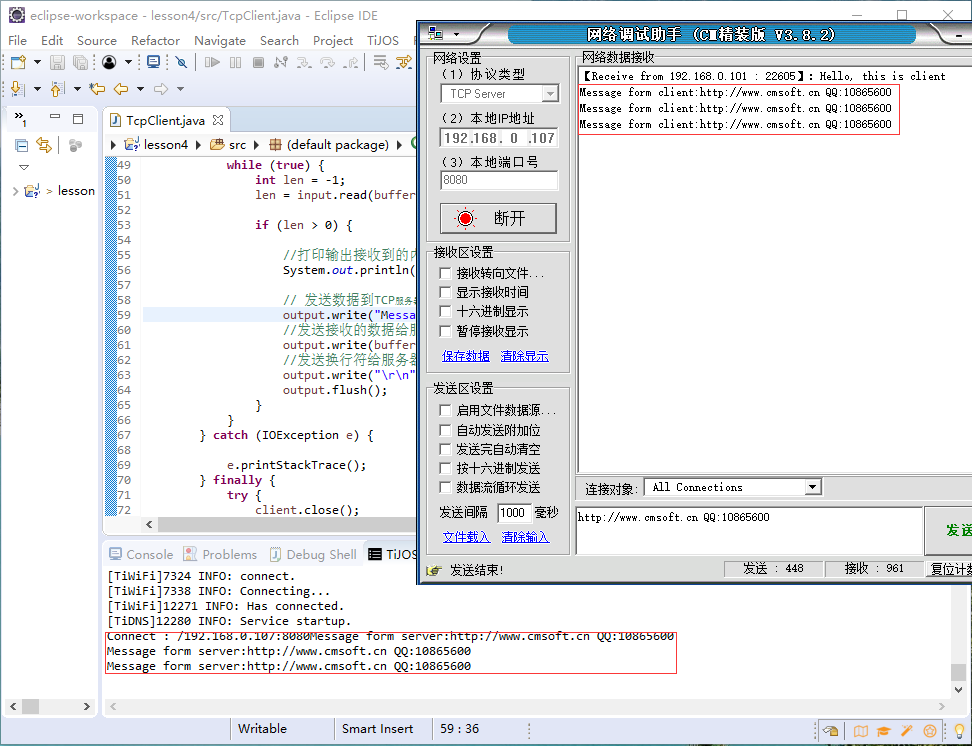

# 设备与网络，TCP通讯技术实现 #

## 温馨提示 ##

- 调试本节课时请您先暂时关闭网络防火墙。 
- 请您先确定路由器能正常使用。
- 请您在连接好设备后在设备属性里WLAN下设置好无线名称和密码。
- 确认钛极小龟能正常连接路由器。

## 第一节、简介 ##

　　TCP（Transmission Control Protocol 传输控制协议）是一种面向连接的、可靠的、基于字节流的传输层通信协议，由IETF的RFC 793定义。在简化的计算机网络OSI模型中，它完成第四层传输层所指定的功能，用户数据报协议（UDP）是同一层内另一个重要的传输协议。在因特网协议族（Internet protocol suite）中，TCP层是位于IP层之上，应用层之下的中间层。不同主机的应用层之间经常需要可靠的、像管道一样的连接，但是IP层不提供这样的流机制，而是提供不可靠的包交换。                                 
　　应用层向TCP层发送用于网间传输的、用8位字节表示的数据流，然后TCP把数据流分区成适当长度的报文段（通常受该计算机连接的网络的数据链路层的最大传输单元（MTU）的限制）。之后TCP把结果包传给IP层，由它来通过网络将包传送给接收端实体的TCP层。TCP为了保证不发生丢包，就给每个包一个序号，同时序号也保证了传送到接收端实体的包的按序接收。然后接收端实体对已成功收到的包发回一个相应的确认（ACK）；如果发送端实体在合理的往返时延（RTT）内未收到确认，那么对应的数据包就被假设为已丢失将会被进行重传。TCP用一个校验和函数来检验数据是否有错误；在发送和接收时都要计算校验和。

## 第二节、操作流程 ##

　　1.打开网络调试助手

　　2.协议类型选择“TCP Server”

　　3.点击“连接”按钮，连接好后按钮上有红色标识

　　4.配置例程，编写程序时，本地IP地址和端口号一定要对应。

　　5.运行自带例程，成功后如下图所示

　　6.点击发送字符串，打印出输入的字符串，同时会将字符串发送给服务器

## 第三节、代码讲解 ##
	import java.io.IOException;
	import java.io.InputStream;
	import java.io.OutputStream;
	import java.net.Socket;
	
	import tijos.framework.networkcenter.dns.TiDNS;
	import tijos.framework.platform.wlan.TiWiFi;
	
	public class TcpClient {
	
		public static void main(String[] args) {
			
			try {
				// 启动连接WLAN, 10秒超时
				// WLAN的设置可通过TiDevManager配置
				TiWiFi.getInstance().startup(10);
	
				// 启动DNS
				TiDNS.getInstance().startup();
			} catch (IOException ex) {
				// 网络连接失败
				ex.printStackTrace();
				return;
			}
	
			// TCP服务器IP及端口号
			String host = "192.168.0.107";
			int port = 8080;
			Socket client = null;
	
			try {
				// 用TCP连接到服务器
				client = new Socket(host, port);
				System.out.print("Connect : " + client.getRemoteSocketAddress());
	
				OutputStream output = client.getOutputStream();
	
				// 发送数据到TCP服务器
				output.write("Hello, this is client".getBytes());
				output.write("\r\n".getBytes());
				output.flush();
	
				// 从服务器获取远程数据
				InputStream input = client.getInputStream();
	
				byte[] buffer = new byte[1024];
				while (true) {
					int len = -1;
					len = input.read(buffer);
	
					if (len > 0) {
						
						//打印输出接收到的内容
						System.out.println("Message form server:" + new String(buffer, 0, len));
						// 发送数据到TCP服务器
						output.write("Message form client:".getBytes());
						//发送接收的数据给服务器
						output.write(buffer, 0, len);
						//发送换行符给服务器
						output.write("\r\n".getBytes());
						output.flush();
					}
				}
			} catch (IOException e) {
	
				e.printStackTrace();
			} finally {
				try {
					client.close();
				} catch (IOException e) {
					/* ignore */}
			}
	
		}
	}

## 第四节、实验现象 ##

　　先把网络助手打开，建立好TCP服务器，然后运行程序后，钛极小龟会自动配置网络，配置过程中网络指示灯会闪烁，连接好网络指示灯会常亮。当服务器断开时，指示灯会关闭。

## 第五节、参考资料 ##

　　TCP详解:https://www.jianshu.com/p/ef892323e68f