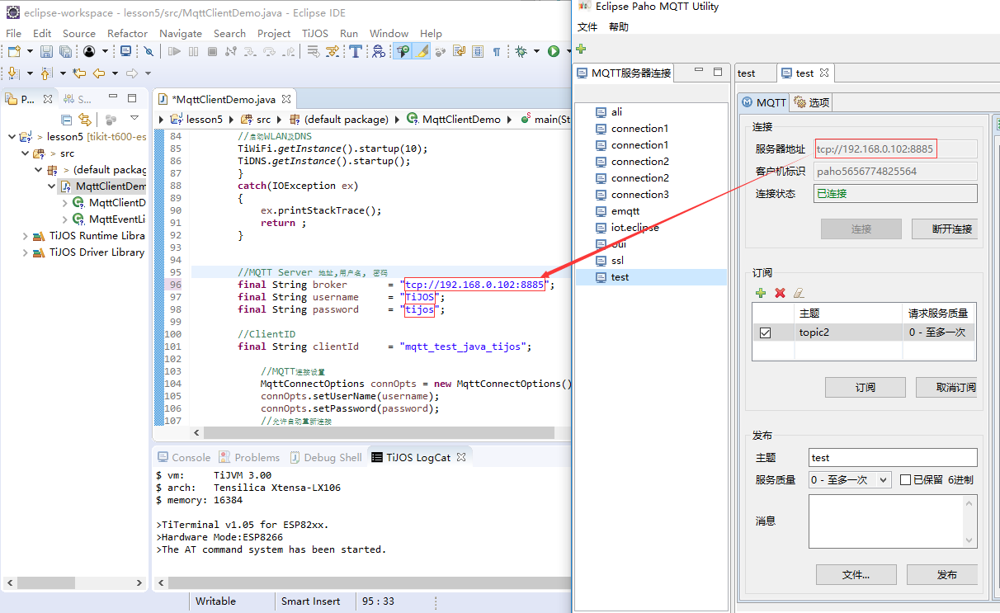

# 设备与物联云，MQTT通讯技术实现 #

## 温馨提示 ##

- 调试本节课时请您先暂时关闭网络防火墙。
- 请您先确定路由器能正常使用。
- 请您在连接好设备后在设备属性里WLAN下设置好无线名称和密码。
- 确认钛极小龟能正常连接路由器。
- 此服务器只是本地服务器，如想连接外地云服务，请您申请相关云账号。
- 如果不知道本地IP地址，请您打开进阶教程LESSON4中网络调试助手获取本地地址。
- 使用本地服务器默认端口号：8885，用户名：TiJOS,密码：tijos。

## 第一节、简介 ##

　　物联云作为物联网应用的一种最新实现及交付模式，由普加智能信息公司（Pujia Inc.）首次提出并实现产业化。其特征在于将传统物联网中传感设备感知的信息和接受的指令连入互联网中，真正实现网络化，并通过云计算技术实现海量数据存储和运算。              
      
　　MQTT（Message Queuing Telemetry Transport，消息队列遥测传输）是一个物联网传输协议，该协议支持所有平台，几乎可以把所有联网物品和外部连接起来，被用来当做传感器和制动器（比如通过Twitt er让房屋联网）的通信协议。它被设计用于轻量级的发布/订阅式消息传输，旨在为低带宽和不稳定的网络环境中的物联网设备提供可靠的网络服务。

## 第二节、操作流程 ##

　　1.打开MQTT本地服务器。

　　2.双击“mqttStart”运行结果如下图：

　　3.双击“redisstart”运行结果如下图：

　　4.打开MQTT调试助手，双击打开“paho.exe”.

　　5.新建MQTT服务器连接，名字任意。

　　6.服务器地址写本机服务器地址（本地IP地址），端口号为：8885。

　　7.点击连接。

　　8.编写程序时MQTT Server 地址,用户名, 密码都是服务器给定的，一定要填写正确。

　　9.订阅主题和发布主题一致才能正常接收到发布的数据。

　　10.运行程序，钛极小龟会自动连接到MQTT服务器上。

## 第三节、代码讲解 ##

	import tijos.framework.networkcenter.dns.TiDNS;
	import tijos.framework.platform.wlan.TiWiFi;
	import tijos.framework.networkcenter.mqtt.MqttClient;
	import tijos.framework.networkcenter.mqtt.MqttClientListener;
	import tijos.framework.networkcenter.mqtt.MqttConnectOptions;
	import tijos.framework.networkcenter.mqtt.MqttException;
	
	import java.io.IOException;
	
	import tijos.framework.util.logging.Logger;
	
	/**
	 * 
	 * MQTT Client 例程, 在运行此例程时请确保MQTT Server地址及用户名密码正确
	 * 
	 * @author TiJOS
	 */
	
	/**
	 * MQTT 事件监听 
	 * 
	 */
	class MqttEventLister implements MqttClientListener
	{
		
		@Override
		public void connectComplete(Object userContext, boolean reconnect) {
			Logger.info("MqttEventLister","connectComplete");
			
		}
	
		@Override
		public void connectionLost(Object userContext) {
			Logger.info("MqttEventLister","connectionLost");
			
		}
		
		@Override
		public void onMqttConnectFailure(Object userContext, int cause) {
			Logger.info("MqttEventLister","onMqttConnectFailure cause = " + cause);
			
		}
	
		@Override
		public void onMqttConnectSuccess(Object userContext) {
			Logger.info("MqttEventLister","onMqttConnectSuccess");
			
		}

		@Override
		public void messageArrived(Object userContext, String topic, byte[] payload) {
			Logger.info("MqttEventLister","messageArrived topic = " + topic + new String(payload));
			
		}
	
		@Override
		public void publishCompleted(Object userContext, int msgId, String topic, int result) {
			Logger.info("MqttEventLister","publishCompleted topic = " + topic + " result = " + result + "msgid = " + msgId);
		
		}
	
		@Override
		public void subscribeCompleted(Object userContext, int msgId,String topic, int result) {
			Logger.info("MqttEventLister","subscribeCompleted topic = " + topic + " result " + result + "msgid = " + msgId);
		
		}
	
		@Override
		public void unsubscribeCompleted(Object userContext, int msgId, String topic, int result) {
			Logger.info("MqttEventLister","unsubscribeCompleted topic = " + topic + "result " + result + "msgid = " + msgId);
	
		}
	
	}
	
	public class MqttClientDemo {
	
		public static void main(String args[]) {
			
			try{
			//启动WLAN及DNS
			TiWiFi.getInstance().startup(10);
			TiDNS.getInstance().startup();
			}
			catch(IOException ex)
			{
				ex.printStackTrace();
				return ;
			}
			//MQTT Server 地址 
			final String broker       = "tcp://192.168.0.102:8885";
			//MQTT Server 用户名
	        final String username     = "TiJOS";
	      //MQTT Server 密码
	        final String password     = "tijos";
	
	        //ClientID
	        final String clientId     = "mqtt_test_java_tijos";
		        
	        	//MQTT连接设置
	            MqttConnectOptions connOpts = new MqttConnectOptions();
	            connOpts.setUserName(username);
	            connOpts.setPassword(password);
	            //允许自动重新连接
	            connOpts.setAutomaticReconnect(true);
	
	            MqttClient mqttClient = new MqttClient(broker, clientId);
	       
	            int qos = 1;
	
		        try {
		           
		        	mqttClient.SetMqttClientListener(new MqttEventLister());
		
		        	//连接MQTT服务器
		            mqttClient.connect(connOpts, mqttClient);
		            
		            //主题topic
		            String topic        = "topic2";
		            String head         = "Message from TiJOS NO. ";
		            
		            //订阅topic
		            int msgId = mqttClient.subscribe(topic, qos);
		            Logger.info("MQTTClientDemo", "Subscribe to topic: " + topic + " msgid = " + msgId);
		         
		            int counter = 0;
		            while(true)
		            {
		            	String content = head + counter;
		            	//发布topic
		            	msgId = mqttClient.publish(topic,content.getBytes(), qos, false);
		                Logger.info("MQTTClientDemo", "Topic " + topic + "Publish message: " + content  + " msgid = " + msgId);
		               
		            	counter ++;
		            	Thread.sleep(1000);
		           }
	
		        } catch(Exception ex) {
		        	
		            ex.printStackTrace(); 
		        }
		        finally
		        {	
		        	try {
		        		//关闭MQTT Server 
						mqttClient.close();
					} catch (MqttException e) {
						/*ignore*/
					} 
		        }
		    }
	}

## 第四节、实验现象 ##

　　编好程序，设置好参数，运行程序，钛极小龟会自动连接MQTT服务器，连接过程中网络指示灯会闪烁。连接后指示灯会常亮，钛极小龟会自动循环发布数据，开启MQTT调试助手，连接到服务器可以订阅小龟发送的数据。

## 第五节、参考资料 ##

　　MQTT协议中文版:https://mcxiaoke.gitbooks.io/mqtt-cn/content/mqtt/03-ControlPackets.html               
　　连接其它云请参见官网：http://dev.tijos.net/docstore/tijos-development-guide/tijos.framework.networkcenter.mqtt/