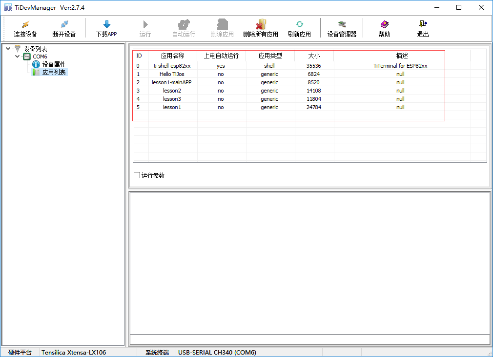

# 综合应用及TiDevManager设备管理器应用 #

## 温馨提示 ##
- 本节课程讲解开发板测试程序。
- 本例程意在测试开发板的是否完好，也是钛极小龟评估板的出厂检测程序。
- 初学者涉及很少TiDevManager设备管理器的应用，选择默认即可。不了解TiDevManager设备管理器盲目更改，调试时很容易报错，所以TiDevManager设备管理器放到最后章节讲解。 
- 只有钛极OS(TiJOS)终端在运行时才能通过TiDevManager进行管理，当设置为自动运行应用时，无法通过TiDevManager进行设备管理，此时可通过退出自动运行应用并进入钛极OS终端的运行方式。

## 第一节、简介 ##

　　本节所讲的例程是我公司为检测钛极小龟评估板全部功能而编写的测试程序，此例程主要通过多线程思想，外挂钛极小龟自带的所有外设。综合程度较高，涉及知识点比较全面，读者学习中有不懂的地方可以随时和我们技术人员联系。                    
　　公司提供的物联网应用的开发平台：能够实现基于物联网万物感知、云端接入为理念的硬件应用开发整合；实现了软硬件结合，可以将碎片化的硬件兼容起来，提供统一的Java层接口给软件开发者。它不仅简化了物联网硬件开发难度，还赋予了制造商高效、敏捷的开发能力，帮助产品加快上市速度。平台聚焦于低成本硬件开发和边缘计算，其核心技术是将Java语言引入到低成本的物联网智能硬件开发中，继承了Java语言面向事件编程、跨平台、屏蔽指针、内存回收和沙盒运行的特点，安全、高效地实现物联网应用开发。同时庞大的Java开发人群，网络上海量的源码资源，再加上平台提供的丰富应用组件，让智能硬件开发不再从零做起，编程像搭积木一样简单。平台适用于智能硬件、智能家居、市政智能监控、工业物联网、农业物联网和教育培训等多种领域。                                                                                                                 

## 第二节、测试例程 ##
### 代码讲解 ###
	import java.io.IOException;
	
	import tijos.framework.devicecenter.TiADC;
	import tijos.framework.devicecenter.TiGPIO;
	import tijos.framework.devicecenter.TiI2CMaster;
	import tijos.framework.platform.peripheral.ITiKeyboardListener;
	import tijos.framework.platform.peripheral.TiKeyboard;
	import tijos.framework.platform.wlan.TiWiFi;
	import tijos.framework.sensor.bh1750.TiBH1750;
	import tijos.framework.sensor.button.ITiButtonEventListener;
	import tijos.framework.sensor.button.TiButton;
	import tijos.framework.sensor.dht.TiDHT;
	import tijos.framework.sensor.vs1838b.ITiVS1838BNECEventListener;
	import tijos.framework.sensor.vs1838b.TiVS1838BNEC;
	import tijos.framework.transducer.oled.TiOLED_UG2864;
	import tijos.framework.transducer.relay.TiRelay1CH;
	import tijos.framework.util.Delay;
	
	/**
	 * WiFi SmartConfig线程类
	 * 
	 * @author tijos
	 *
	 */
	class WiFiSCThread implements Runnable {
		TiOLED_UG2864 _oled;
	
		// 构造
		public WiFiSCThread(TiOLED_UG2864 oled) {
			this._oled = oled;
		}
	
		@Override
		public void run() {
	
			try {
				// 显示SmartConfig启动信息
				this._oled.print(3, 0, "Wi-Fi SC startup ");
				// 启动SmartConfig 30秒超时
				TiWiFi.getInstance().smartConfig(30);
				// 显示成功信息
				this._oled.print(3, 0, "Wi-Fi SC success");
			} catch (IOException e) {
				try {
					// 显示失败信息
					this._oled.print(3, 0, "Wi-Fi SC fail   ");
				} catch (IOException e1) {
				}
			}
		}
	
	}
	
	/**
	 * MIC模拟信号采集线程类
	 * 
	 * @author tijos
	 *
	 */
	class EMICThread implements Runnable {
		TiADC _adc;
		TiOLED_UG2864 _oled;
	
		// 构造
		public EMICThread(TiADC adc, TiOLED_UG2864 oled) {
			this._adc = adc;
			this._oled = oled;
		}
	
		@Override
		public void run() {
	
			try {
				while (true) {
					// 获取咪头(MIC)电压
					int val = this._adc.getRawValue(0);
					// 显示咪头(MIC)电压
					this._oled.print(2, 0, "MIC: " + val + "    ");
					Delay.msDelay(50);
				}
			} catch (IOException e) {
				e.printStackTrace();
			}
		}
	
	}
	
	/**
	 * 键盘监听类
	 * 
	 * @author tijos
	 *
	 */
	class KeyboardListener implements ITiKeyboardListener {
		TiOLED_UG2864 _oled;
		Thread _thread;
	
		// 构造
		public KeyboardListener(TiOLED_UG2864 oled) {
			this._oled = oled;
		}
	
		@Override
		public void onPressed(int arg0, long arg1) {
	
		}
	
		@Override
		public void onReleased(int arg0, long arg1) {
			// 确保SmartConfig线程还未创建
			if (this._thread != null && this._thread.isAlive()) {
				return;
			}
			// 创建SmartConfig线程并启动
			this._thread = new Thread(new WiFiSCThread(this._oled));
			this._thread.start();
		}
	
	}
	
	/**
	 * 红外解码监听类
	 * 
	 * @author tijos
	 *
	 */
	class IRDecodeListener implements ITiVS1838BNECEventListener {
		TiOLED_UG2864 _oled;
	
		// 构造
		public IRDecodeListener(TiOLED_UG2864 oled) {
			this._oled = oled;
		}
	
		@Override
		public void cmdReceived(TiVS1838BNEC arg0) {
			try {
				// 显示红外解码值
				this._oled.print(3, 0, "IR: " + arg0.getAddress() + " - " + arg0.getCommand() + "      ");
			} catch (IOException e) {
				e.printStackTrace();
			}
		}
	
		@Override
		public void cmdRepeat(TiVS1838BNEC arg0) {
		}
	
	}
	
	/**
	 * 触摸监听类
	 * 
	 * @author tijos
	 *
	 */
	class TouchListener implements ITiButtonEventListener {
		TiRelay1CH _relay;
	
		// 构造
		public TouchListener(TiRelay1CH relay) {
			this._relay = relay;
		}
	
		@Override
		public void onPressed(TiButton arg0) {
			try {
				// 继电器打开
				this._relay.turnOn();
			} catch (IOException e) {
				e.printStackTrace();
			}
		}
	
		@Override
		public void onReleased(TiButton arg0) {
			try {
				// 继电器关闭
				this._relay.turnOff();
			} catch (IOException e) {
				e.printStackTrace();
			}
		}
	}
	
	/**
	 * 开发板全功能测试
	 * 
	 * @author tijos
	 *
	 */
	public class TiKitTest {
	
		public static void main(String[] args) {
	
			try {
				/* ---资源分配--- */
				// GPIO资源分配，GPIO0的PIN2/3/4/5脚
				TiGPIO gpio0 = TiGPIO.open(0, 2, 3, 4, 5);
				// I2C主机总线资源分配，I2CM0
				TiI2CMaster i2cm0 = TiI2CMaster.open(0);
				// ADC资源分配，ADC0的CH0通道
				TiADC adc0 = TiADC.open(0, 0);
	
				/* ---资源绑定--- */
				// I2C主机总线资源PORT0与屏幕对象绑定，屏幕地址：0x3C
				TiOLED_UG2864 oled = new TiOLED_UG2864(i2cm0, 0x3c);
				// I2C主机总线资源PORT0与照度计BH1750对象绑定，默认地址：0x23
				TiBH1750 bh1750 = new TiBH1750(i2cm0);
				// GPIO总线资源PIN2与继电器对象绑定
				TiRelay1CH relay = new TiRelay1CH(gpio0, 2);
				// GPIO总线资源PIN3与温湿度传感器DHT11绑定
				TiDHT dht11 = new TiDHT(gpio0, 3);
				// GPIO总线资源PIN4与触摸按钮对象绑定，触发电平：高电平
				TiButton touch = new TiButton(gpio0, 4, true);
				// GPIO总线资源PIN5与红外解码对象绑定
				TiVS1838BNEC vs1838b = new TiVS1838BNEC(gpio0, 5);
				// 获取键盘实例并设置键盘事件监听对象
				TiKeyboard keyboard = TiKeyboard.getInstance();
				keyboard.setEventListener(new KeyboardListener(oled));
				// 设置红外解码事件监听对象
				vs1838b.setEventListener(new IRDecodeListener(oled));
				// 设置触摸按钮事件监听对象
				touch.setEventListener(new TouchListener(relay));
				// 设置ADC参考电压及分压倍数
				adc0.setRefVoltageValue(1.0, 2);
	
				/* ---资源使用--- */
				// 屏幕开启并清屏
				oled.turnOn();
				oled.clear();
				oled.print(3, 0,"Welcomes YOU ! ");
				// 创建MIC模拟电压采集线程对象并启动线程
				Thread thread = new Thread(new EMICThread(adc0, oled));
				thread.setDaemon(true);
				thread.start();
			
				while (true) {
					// 启动温湿度测量
					dht11.measure();
					// 获取温湿度值
					double temp = dht11.getTemperature();
					double humi = dht11.getHumidity();
					// 获取光照度值
					int lux = bh1750.readLightLevel();
					// 显示温湿度及光照度
					oled.print(0, 0, "TH: " + temp + "C  " + humi + "%");
					oled.print(1, 0, "LUX: " + lux + "    ");
					
					// 等待2秒
					Delay.msDelay(2000);
				}
	
			} catch (IOException e) {
				e.printStackTrace();
			
			}
		}
	
	}

### 实验现象 ###

　　本例程运行后，开发板的液晶屏、普通按键、触摸按键、温湿度传感器、光照度传感器、麦克风、继电器和红外遥控等外设都挂载在CPU上，并运行。液晶屏第一行显示当前的温湿度，第二行显示当前的光照度，第三行显示当前的噪声强度，第四行为复用行，可以显示红外遥控的解码值，也可以显示WIFI一键配置的状态，这取决于测试时的人为操作， 触摸按键控制继电器及其继电器指示灯。按下普通按键会进入WIFI一键配置模式。

## 第三节、TiDevManager 设备管理器使用说明 ##

TiDevManager设备管理器是TiStudio一部分，无需单独安装, 该工具主要用于操作TiKit开发板进行设备诊断、配置、应用执行等功能, 支持所有型号的TiKit开发板，并会根据TiKit型号支持不同的属性设置，为用户提供统一测试开发工具。

TiDevManager设备管理器是TiKit的控制面板，可非常方便的对设备及应用进行管理和测试，包括：

- 通过应用下载端口与TiKit建立连接并获取设备信息
- 对TiKit开发板基础信息及网络进行设置
- 快速下载应用到TiKit开发板中并进行应用管理
- 运行TiKit开发板中应用并输出日志

钛极OS(TiJOS)应用开发主要在Eclipse中进行, TiDevManager只是方便用户进行设备的设置和诊断，在需要时使用即可。

### 连接TiKit开发板

将TiKit 连接到USB口之后， 可通过"连接设备"按钮选择TiKit的端口并进行连接

当TiDevManager连接到TiKit时，会自动加载设备信息并连接设备的日志打印口，如下图：

### 系统设置

#### 设备属性

连接成功后，可通过设备属性显示设备的ID、版本、处理器、存储空间等信息。通过菜单栏可对设备进行连接、断开及应用管理等功能，如系统中识别多个设备，可通过连接设备来切换。

#### 主机信息设置

通过设备属性页中的设置属性可进行主机信息设置，包括主机名称、日志等级及当前时间，如下图，

##### 日志输出控制

钛极OS(TiJOS)提供了日志类Logger, 可用于在应用中输出日志， 同时， 日志极别可通过TiDevManager进行设置以方便通过日志进行分析

输出日志等级，根据开发的过程设置输出相关日志

以上信息，修改后点击确定即可

##### 时间设置

设置主机当前RTC时间， 需支持电池供电。

#### 网络设置

网络设置是TiDevManager的另一重要功能，网络设置通过设备属性进行设置， 可设置包括主机名称，WLAN, IP, DNS等， 如果支持AP， 还可设置AP相关的广播名称和连接密码等。

注意:网络设置在用户应用中通过TiWiFiN启动网络连接时起作用，钛极OS(TiJOS)不会自动连接网络， 如果应用中用不到网络，也可不进行设置。

##### WLAN

类似于无线终端，本身并不接受无线的接入，它可以连接到AP，一般无线网卡即工作在该模式，设置SSID及密码，可自动获取IP地址，或手动填写指定IP、子网掩码、网关信息

##### AP

AP模式，提供无线接入服务，允许其它无线设备接入，提供数据访问，设置SSID及密码，IP、可自动获取IP地址，或手动填写指定IP、子网掩码、网关信息

##### DNS

首选DNS与备用DNS设置，如果没有更优的DNS可采用设备默认DNS

### 应用管理

#### 应用列表

选择应用列表后，TiKit中的所有应用会列举出来，如下图所示：

#### 下载应用

在开发过程中TiStudio会负责应用的自动下载和执行，当应用开发完成后，可能需要将应用发送给其他人进行测试，此时可通过TiStudio导出tapk应用文件，并通过TiDevManager手工下载并运行进行测试。

通过点击"下载APP"，选择要下载的应用tapk文件及应用ID， 如下图：

下载过程中请勿断开设备，以免造成下载失败， 应用ID已有应用将被覆盖。

#### 运行应用

当需要运行指定应用时， 可在应用列表选中该应用，点击"运行"按钮即可.

如果该应用支持运行参数， 选中运行参数选择框后输入相应的参数后点击运行即可。

日志窗口会有日志输出，如下图：

日志可以保存成文件，也可输出到文件实时监测COM口数据输出，在日志窗口中右键，如下图：

设置日志输出：可将日志输出到临时目录的文件中，方便查看

#### 设置自动运行指定应用

钛极OS(TiJOS)支持指定应用为上电自动运行， 设置后钛极OS(TiJOS)启动时会自动运行该应用， 一般用于设备产品化时上电自动运行指定的应用。

当需要返回钛极OS(TiJOS)终端时, 可通过按住TiKit开发板上综色"Fn.T"按钮再按橘黄色"RST/WKUP"铵钮来完成， 流程如下：

1. 按住综色"Fn.T"按键，不要放开
2. 按橘黄色"RST/WKUP"按键一秒后放开
3. 放开综色"Fn.T"按键，后进入钛极OS(TiJOS)终端， 此时可使用TiDevManager进行设备管理

 **如果想继续调试程序，请改回(ti-shell-espxx)终端自动运行,	否则每次运行程序都要进行返回钛极OS(TiJOS)终端操作。**

#### 删除应用

该按钮用于删除当前选中应用

#### 删除所有应用

点击该按钮后，所有应用都将被删除。

