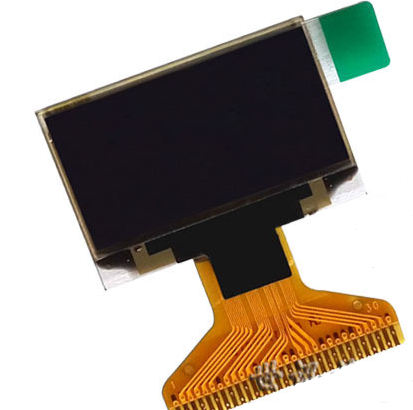
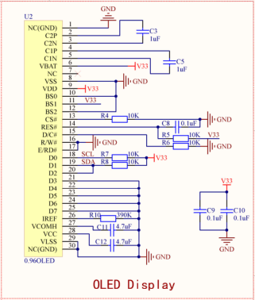

# TiJOS的故事，屏幕文本滚动显示 #

## 温馨提示 ##
- 本节课程讲述液晶屏的使用和调试的整体流程，请读者认真学习。
- 初学者不建议直接导入例程，最好自己建立新工程编写程序，调试。
- 在今后工程中遇到与本课相关的问题，请参照本节课程。
- 在运行程序前请您先按复位，否则可能会报错。
- 程序主要是访问液晶屏的操作流程，液晶屏驱动库属于标注库，添加标准库后，可以直接调用液晶屏实例。
## 第一节、简介 ##
 
　　实物图：

　　OLED 屏幕作为一种新型的显示技术，其自身可以发光，亮度好，对比度高，功耗低，在当下备受追捧。分辨率为128x64，即OLED显示是128行x64列，屏幕尺寸为 0.96 寸。由于其较小的尺寸和比较高的分辨率，让它有着很好的显示效果和便携性，但是由于OLED不能一次控制一个点阵,只能控制8个点阵;而且是垂直方向扫描控制;因此垂直方向坐标可选为0~7;(8*8=64);水平方向可选坐标0~127。

## 第二节、外设功能框图分析 ##

　　原理图：

　　TiOLED_UG2864实例在创建时需要和具体总线设备绑定，具体绑定类型与其工作方式以及通讯协议有关，本实例绑定的设备总线类为 tijos.framework.devicecenter.TiI2C。

## 第三节、代码讲解 ##
   
    import java.io.IOException;

	import tijos.framework.devicecenter.TiI2CMaster;
	import tijos.framework.transducer.oled.TiOLED_UG2864;
	import tijos.framework.util.Delay;
	
	/**
	 * TiJOS的故事，屏幕文本滚动显示
	 * 
	 * @author tijos
	 *
	 */
	public class TiJOSStory {
		// 第1屏字符串内容
		static String screen1 = "Hi, i am TiJOS. " + "I'm an operating" + "system that can " + "be programmed in";
		// 第2屏字符串内容
		static String screen2 = "java language.  " + "I'm trying to   " + "become a Android" + "in the Internet ";
		// 第3屏字符串内容
		static String screen3 = "of things.";
	
		public static void main(String[] args) {
	
			try {
				// I2C主机总线资源分配，I2C PORT0
				TiI2CMaster i2cm0 = TiI2CMaster.open(0);
				// I2C主机总线资源与屏幕对象绑定，屏幕地址：0x3C
				TiOLED_UG2864 oled = new TiOLED_UG2864(i2cm0, 0x3c);	
				// 屏幕开启并清屏
				oled.turnOn();
				oled.clear();
				// 通过屏幕循环打印
				while (true) {
					// 显示第1屏内容，等待2秒后清屏
					oled.output(screen1);
					Delay.msDelay(2000);
					oled.clear();
					// 显示第2屏内容，等待2秒后清屏
					oled.output(screen2);
					Delay.msDelay(2000);
					oled.clear();
					// 显示第3屏内容，等待2秒后清屏
					oled.output(screen3);
					Delay.msDelay(2000);
					oled.clear();
				}
			} catch (IOException e) {
				e.printStackTrace();
			}
		}
	
	}
## 第四节、实验现象 ##

　　程序编译运行后，液晶屏幕会滚动显示TiJOS的故事（英文版）。

## 第五节、参考资料 ##

　　液晶屏详细介绍请参考：https://www.jianshu.com/p/7e54ebb387ee

　　设备总线的使用请参考：http://dev.tijos.net/docstore/tijos-development-guide/tijos.framework.devicecenter.TiI2CMaster/

