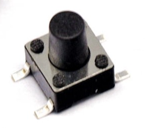
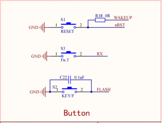

# 按我一下，控制按钮KEY #

## 温馨提示 ##
- 本节课程讲述轻触按键调试的整体流程，请读者认真学习。
- 初学者不建议直接导入例程，最好自己建立新工程编写程序，调试。
- 在今后工程中遇到与本课相关的问题，请参照本节课程。
- 在运行程序前请您先按复位，否则可能会报错。
- 在编写程序前请先添加标准库。

## 第一节、简介 ##

　　实物图：

　　轻触按键其实相当于是一种电子开关，只要轻轻的按下按键开关就会接通，松开时开关就断开连接，实现原理主要是通过轻触按键内部的金属弹片受力弹动来实现接通和断开。

## 第二节、外设功能框图分析 ##

　　原理图：

　　此处按键为低电平触发。

## 第三节、代码讲解 ##

	import java.io.IOException;
	
	import tijos.framework.devicecenter.TiI2CMaster;
	import tijos.framework.platform.peripheral.ITiKeyboardListener;
	import tijos.framework.platform.peripheral.TiKeyboard;
	import tijos.framework.transducer.oled.TiOLED_UG2864;
	
	/**
	 * 监听者
	 * 
	 * @author tijos
	 *
	 */
	class KEYListener implements ITiKeyboardListener {
	
	
		TiOLED_UG2864 _oled;
	
		public KEYListener(TiOLED_UG2864 oled) {
			// TODO Auto-generated constructor stub
			this._oled = oled;
		}
	
		@Override
		public void onPressed(int arg0, long arg1) {
			try {
				// 屏幕实现
				this._oled.print(2, 0, "onPressed. ");
				// 终端打印
				System.out.println("onPressed. ");
			} catch (IOException e) {
				e.printStackTrace();
			}
		}
	
		@Override
		public void onReleased(int arg0, long arg1) {
			try {
				// 屏幕实现
				this._oled.print(2, 0, "onReleased.");
				// 终端打印
				System.out.println("onReleased.");
			} catch (IOException e) {
				e.printStackTrace();
			}
		}
	}
	
	/**
	 * 按我一下，控制按钮KEY
	 * 
	 * @author tijos
	 *
	 */
	public class PressMe {
	
		public static void main(String[] args) {
	
			try {
				TiI2CMaster i2cm0 = TiI2CMaster.open(0);
				// I2C主机总线资源与屏幕对象绑定，屏幕地址：0x3C
				TiOLED_UG2864 oled = new TiOLED_UG2864(i2cm0, 0x3c);	
				// 屏幕开启并清屏
				oled.turnOn();
				oled.clear();
				// 显示并打印标题
				oled.print(0, 0, "Press me.");
				System.out.println("Press me");
				// 创建监听对象
				KEYListener lc = new KEYListener(oled);
				// 获取键盘实例
				TiKeyboard kb = TiKeyboard.getInstance();
				// 设置键盘事件监听对象
				kb.setEventListener(lc);
	
				while (true) {
				}
			} catch (IOException e) {
				e.printStackTrace();
			}
		}
	
	}
	
	

## 第四节、实验现象 ##	

　　打印输出"Press me"，同时打印输出"Press me."按下普通按键液晶屏会显示"onPressed. "同时打印输出"onPressed. "，释放普通按键液晶屏会显示"onReleased."同时打印输出"onReleased."。

## 第五节、参考资料 ##

　　按键详细介绍：https://baike.baidu.com/item/轻触按键/8035883

