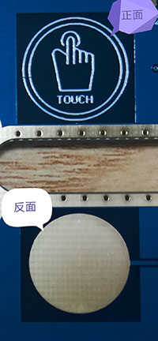
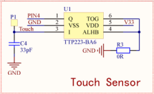

# 摸我一下，Touch触摸按钮 #

## 温馨提示 ##
- 本节课程讲述触摸按键调试的整体流程，请读者认真的学习。
- 初学者不建议直接导入例程，最好自己建立新工程编写程序，调试。
- 在今后工程中遇到与本课相关的问题，请参照本节课程。
- 在运行程序前请您先按复位，否则可能会报错。
- 在编写程序前请先添加标准库。
## 第一节、简介 ##

　　实物图：

　　首先是键的本身比较特殊，它是直接利用PCB制做的，上边再覆盖一层绝缘层而成。结构上，触片的周围和背面都是地线。         
　　当手触摸时，则会改变触片极与地之间的等效电容量，使之加大，通过电路检测这一变化就可以判断出来触片被触。

## 第二节、外设功能框图分析 ##

　　原理图：

　　触摸按键需要芯片TTP223-BA6检测IC，才能产生按键的效果。

## 第三节、代码讲解 ##
	import java.io.IOException;
	
	import tijos.framework.devicecenter.TiGPIO;
	import tijos.framework.devicecenter.TiI2CMaster;
	import tijos.framework.sensor.button.ITiButtonEventListener;
	import tijos.framework.sensor.button.TiButton;
	import tijos.framework.transducer.oled.TiOLED_UG2864;
	
	/**
	 * 监听类
	 * 
	 * @author tijos
	 *
	 */
	class TouchListener implements ITiButtonEventListener {
		TiOLED_UG2864 _oled;
	
		// 构造
		public TouchListener(TiOLED_UG2864 oled) {
			this._oled = oled;
		}
	
		@Override
		public void onPressed(TiButton arg0) {
			try {
				// 屏幕实现
				this._oled.print(2, 0, "onPressed. ");
				// 终端打印
				System.out.println("onPressed. ");
			} catch (IOException e) {
				e.printStackTrace();
			}
		}
	
		@Override
		public void onReleased(TiButton arg0) {
			try {
				// 屏幕实现
				this._oled.print(2, 0, "onReleased.");
				// 终端打印
				System.out.println("onReleased.");
			} catch (IOException e) {
				e.printStackTrace();
			}
		}
	}
	
	/**
	 * 摸我一下，Touch触摸按钮 
	 * 
	 * @author tijos
	 *
	 */
	public class TouchMe {
	
		public static void main(String[] args) {
	
			try {
				// GPIO资源分配，GPIO0的PIN4脚
				TiGPIO gpio0 = TiGPIO.open(0, 4);
				// I2C主机总线资源分配，I2C PORT0
				TiI2CMaster i2cm0 = TiI2CMaster.open(0);
				// I2C主机总线资源与屏幕对象绑定，屏幕地址：0x3C			
				TiOLED_UG2864 oled = new TiOLED_UG2864(i2cm0, 0x3c);
				// GPIO总线资源与触摸按钮对象绑定，触发电平：高电平
				TiButton touch = new TiButton(gpio0, 4, true);	
				// 屏幕开启并清屏
				oled.turnOn();
				oled.clear();
				// 显示并打印标题
				oled.print(0, 0, "Touch me.");
				System.out.println("Touch me.");
				// 创建监听者，并传入屏幕实例
				TouchListener lc = new TouchListener(oled);
				// 设置触摸按键事件监听者
				touch.setEventListener(lc);
	
				while (true) {
				}
			} catch (IOException e) {
				e.printStackTrace();
			}
		}
	
	}
## 第四节、实验现象 ##

　　液晶屏会显示"Touch me."同时打印输出"Touch me."，摸下触摸按键液晶屏会显示"onPressed. "同时打印输出"onPressed. "，释放触摸按键液晶屏会显示"onReleased."同时打印输出"onReleased."。

## 第五节、参考资料 ##

　　触摸按键详细介绍：https://baike.baidu.com/item/电容式触摸按键/18654527?fr=aladdin

　　芯片TTP223-BA6详细介绍：https://wenku.baidu.com/view/0450825fba68a98271fe910ef12d2af90342a853.html

