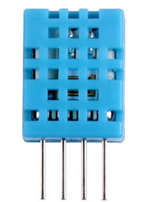
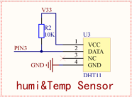

# DIY温湿度计，温湿度采集 #

## 温馨提示 ##

- 本节课程讲述采集温湿度调试的整体流程，请读者认真学习。
- 初学者不建议直接导入例程，最好自己建立新工程编写程序，调试。
- 在今后工程中遇到与本课相关的问题，请参照本节课程。
- 在运行程序前请您先按复位，否则可能会报错。
- 在编写程序前请先添加标准库。

## 第一节、简介 ##

　　实物图：

　　DHT11数字温湿度传感器是一款含有已校准数字信号输出的温湿度复合传感器，其精度湿度+-5%RH， 温度+-2℃，量程湿度20-90%RH， 温度0~50℃。它应用专用的数字模块采集技术和温湿度传感技术，确保产品具有极高的可靠性和卓越的长期稳定性。传感器包括一个电阻式感湿元件和一个NTC测温元件，并与一个高性能8位单片机相连接。

## 第二节、外设功能框图分析 ##

　　原理图：

　　图中R2为上拉电阻，DHT11与CPU连接引脚为PIN3。

　　温湿度采集用的是1-Wire总线，是一个简单的信号传输电路，可通过一根共用的数据线实现主控制器与一个或一个以上从器件之间的半双工双向通信。

## 第三节、代码讲解 ##

	import java.io.IOException;
	
	import tijos.framework.devicecenter.TiGPIO;
	import tijos.framework.devicecenter.TiI2CMaster;
	import tijos.framework.sensor.dht.TiDHT;
	import tijos.framework.transducer.oled.TiOLED_UG2864;
	import tijos.framework.util.Delay;

	/**
	 * DIY温湿度计，温湿度采集
	 * 
	 * @author andy
	 *
	 */
	public class FirstDIY {
	
		public static void main(String[] args) {
			
			try {
				// GPIO资源分配，GPIO0的PIN3脚
				TiGPIO gpio0 = TiGPIO.open(0, 3);
				// I2C主机总线资源分配，I2C PORT0
				TiI2CMaster i2cm0 = TiI2CMaster.open(0);
				// GPIO总线资源与温湿度传感器DHT11绑定
				TiDHT dht11 = new TiDHT(gpio0, 3);
				// I2C主机总线资源与屏幕对象绑定，屏幕地址：0x3C
				TiOLED_UG2864 oled = new TiOLED_UG2864(i2cm0, 0x3c);
				// 屏幕开启并清屏
				oled.turnOn();
				oled.clear();
				// 显示标题
				oled.print(0, 0, "My first DIY");
				// 通过屏幕循环打印
				while (true) {
					// 开启测量
					dht11.measure();
					// 显示温湿度
					oled.print(2, 0, "TEMP: " + dht11.getTemperature() + "  C");
					oled.print(3, 0, "HUMI: " + dht11.getHumidity() + "  %");
					// 等待2秒
					Delay.msDelay(2000);
				}
			} catch (IOException e) {
				e.printStackTrace();
			}
		}
	
	}

## 第四节、实验现象 ##

　　液晶屏显示当前温度和湿度，两秒更新一次。

## 第五节、参考资料 ##

　　温湿度传感器详细介绍：https://wenku.baidu.com/view/7b906a297275a417866fb84ae45c3b3567ecddfa.html

　　DHT系列温湿度传感类访问介绍：http://dev.tijos.net/docstore/tijos-driver/tijos.framework.sensor.dht/

　　访问总线介绍:http://dev.tijos.net/docstore/tijos-development-guide/tijos.framework.devicecenter.TiOWMaster/

