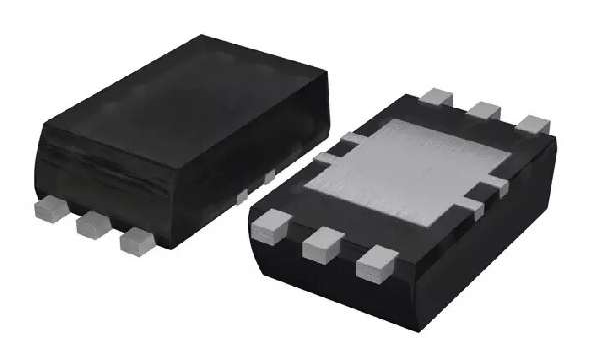
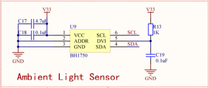

# 感受世界的光明，光照度采集 #

## 温馨提示 ##
- 本节课程讲述光照度采集和调试的整体流程，请读者认真的学习。
- 初学者不建议直接导入例程，最好自己建立新工程编写程序，调试。
- 在今后工程中遇到与本课相关的问题，请参照本节课程。
- 在运行程序前请您先按复位，否则可能会报错。
- 在编写程序前请先添加标准库。
## 第一节、简介 ##

　　实物图：

　　BH1750是一种用于两线式串行总线接口的数字型光强度传感器集成电路。利用它的高分辨率可以探测较大范围的光照强度变化。（1lux-65536lux）

## 第二节、外设功能框图分析 ##

　　电路图：
 

　　光照度采集需要绑定的设备总线，总线类为 tijos.framework.devicecenter.TiI2C。

## 第三节、代码讲解 ##

    import java.io.IOException;

	import tijos.framework.devicecenter.TiI2CMaster;
	import tijos.framework.sensor.bh1750.TiBH1750;
	import tijos.framework.transducer.oled.TiOLED_UG2864;
	import tijos.framework.util.Delay;
	
	    /**
		 * 光照度采集，屏幕显示
		 * 
		 * @author tijos
		 *
		 */
	
	public class Illuminance {
	
		public static void main(String[] args) {
	
			try {
				// I2C主机总线资源分配，I2C PORT0
				TiI2CMaster i2cm0 = TiI2CMaster.open(0);
				// I2C主机总线资源与屏幕对象绑定，屏幕地址：0x3C
				TiOLED_UG2864 oled = new TiOLED_UG2864(i2cm0, 0x3c);
				// I2C主机总线资源与照度计BH1750对象绑定，默认地址：0x23			
				TiBH1750 bh1750 = new TiBH1750(i2cm0);
				// 屏幕开启并清屏
				oled.turnOn();
				oled.clear();
				// 显示标题
				oled.print(0, 0, "Illuminamce test");
				// 循环采集照度并显示和打印
				while (true) {			
					//获取光照度值
					int lux = bh1750.readLightLevel();
	                //日志打印输出 
					System.out.println("Light : " + lux + " lux");
					//液晶屏输出
					oled.print(2, 0, "Light : " + lux + " lux");
					Delay.msDelay(1000);
				}
	
			} catch (IOException ex) {
			
				ex.printStackTrace();
			}
		}
	
	}
## 第四节、实验现象 ##

　　液晶屏显示同时日志打印输出当前光照度，一秒更新一次。

## 第五节、参考资料 ##

　　光照度传感器详细介绍：https://wenku.baidu.com/view/9de0236daf1ffc4ffe47acdb.html

　　设备总线的使用请参考：http://dev.tijos.net/docstore/tijos-development-guide/tijos.framework.devicecenter.TiI2CMaster/

