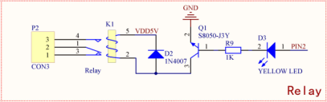

# 静悄悄的开灯，延时触摸开关 #

## 温馨提示 ##
- 本节课程讲述继电器的使用和调试的整体流程，请读者认真的学习。
- 初学者不建议直接导入例程，最好自己建立新工程编写程序，调试。
- 在今后工程中遇到与本课相关的问题，请参照本节课程。
- 第三节课已经讲述触摸按键，在本节课用到触摸按键，但不重复介绍。
- 在运行程序前请您先按复位，否则可能会报错。
- 在编写程序前请先添加标准库。

## 第一节、简介 ##

　　实物图：

　　继电器是一种电控制器件，是当输入量（激励量）的变化达到规定要求时，在电气输出电路中使被控量发生预定的阶跃变化的一种电器。它具有控制系统（又称输入回路）和被控制系统（又称输出回路）之间的互动关系。通常应用于自动化的控制电路中，它实际上是用小电流去控制大电流运作的一种“自动开关”。

## 第二节、外设功能框图分析 ##
　　原理图：

　　此处LED发光二极管为输入控制端，并非继电器输出控制。继电器PCB走线承受最大电流为2.5A，继电器只可接入功率不大于500W的电器。

## 第三节、代码讲解 ##

    import java.io.IOException;

	import tijos.framework.devicecenter.TiGPIO;
	import tijos.framework.devicecenter.TiI2CMaster;
	import tijos.framework.sensor.button.ITiButtonEventListener;
	import tijos.framework.sensor.button.TiButton;
	import tijos.framework.transducer.oled.TiOLED_UG2864;
	import tijos.framework.transducer.relay.TiRelay1CH;
	import tijos.framework.util.Delay;
	
	/**
	 * 监听类
	 * 
	 * @author tijos
	 *
	 */
	class TouchListener implements ITiButtonEventListener {
		boolean _isOnPressed = false;
	
		@Override
		public void onPressed(TiButton arg0) {
			synchronized (this) {
				// 置按下标志
				this._isOnPressed = true;
			}
		}
	
		@Override
		public void onReleased(TiButton arg0) {
			synchronized (this) {
				// 置释放标志
				this._isOnPressed = false;
			}
		}
	
		public boolean isPressed() {
			boolean pressed = false;
			synchronized (this) {
				// 返回置按下标志
				pressed = this._isOnPressed;
			}
			return pressed;
		}
	}
	
	/**
	 * 静悄悄的开灯，延时触摸开关
	 * 
	 * @author tijos
	 *
	 */
	public class TouchLight {
	
		public static void main(String[] args) {
	
			try {
				// GPIO资源分配，GPIO0的PIN2和PIN4脚
				TiGPIO gpio0 = TiGPIO.open(0, 2, 4);
				// GPIO资源分配，GPIO0的PIN4脚
				TiI2CMaster i2cm0 = TiI2CMaster.open(0);
				// I2C主机总线资源与屏幕对象绑定，屏幕地址：0x3C
				TiOLED_UG2864 oled = new TiOLED_UG2864(i2cm0, 0x3c);	
				// 屏幕开启并清屏
				oled.turnOn();
				oled.clear();
				oled.print(0, 0, "Touch switch");
				// GPIO总线资源与继电器对象绑定
				TiRelay1CH relay = new TiRelay1CH(gpio0, 2);
				// GPIO总线资源与触摸按钮对象绑定，触发电平：高电平
				TiButton touch = new TiButton(gpio0, 4, true);
				// 创建触摸按钮事件监听者
				TouchListener lc = new TouchListener();
				// 设置触摸按钮事件监听者
				touch.setEventListener(lc);
				// 循环检测
				while (true) {
					// 检测到按钮按下
					if (lc.isPressed()) {
						// 打开继电器
						relay.turnOn();
						oled.print(2, 0, "Open switch");
						// 延时10秒
						Delay.msDelay(10*1000);
					} else {
						// 关闭继电器
						relay.turnOff();
						oled.print(2, 0, "Close switch");
					}
					// 检测间隔100ms
					Delay.msDelay(100);
				}
			} catch (IOException e) {
				e.printStackTrace();
			}
		}
	
	}

## 第四节、实验现象 ##

　　液晶屏显示继电器开关状态，触摸触摸按键打来继电器和对应的指示灯，十秒后自动关闭。

## 第五节、参考资料 ##

　　继电器的详细介绍：https://baike.baidu.com/item/继电器

