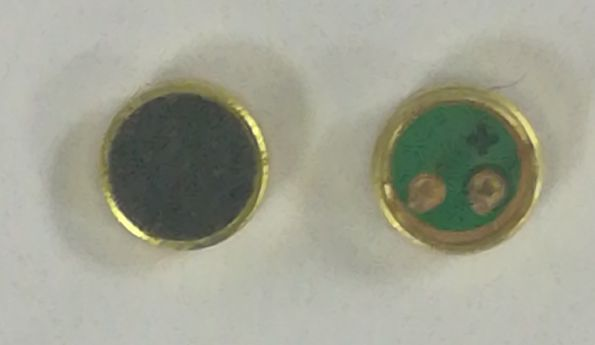
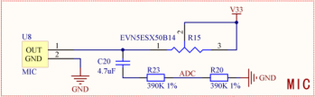

# 咳一声灯亮了，延时声控开关 #

## 温馨提示 ##
- 本节课程讲述麦克风使用和调试的整体流程，请读者认真学习。
- 初学者不建议直接导入例程，最好自己建立新工程编写程序，调试。
- 在今后课程中工程中遇到与本课相关的问题，请参照本节课程。
- 第六节课中已经介绍继电器，在本节课中用到继电器但不重复介绍。
- 由于麦克风元器件稳定性的有差异，采集电压比较阈值需要自己调整。
- 在运行程序前请您先按复位，否则可能会报错。
- 在编写程序前请先添加标准库。
## 第一节、简介 ##
　　实物图：

　　麦克风是将声音信号转换为电信号的能量转换器件，是和喇叭（电→声）正好相反的器件。是声音设备的两个终端，麦克风是输入，喇叭是输出。又名咪芯，咪头，话筒，传声器。   

## 第二节、外设功能框图分析 ##
　　原理图：

　　R23和R20为分压电阻，CPU检测模拟信号转换为数字信号只支持0~1V，麦克风通过可变电阻R15调节，最大输出的为2V。

## 第三节、代码讲解 ##

    import java.io.IOException;
	
	import tijos.framework.devicecenter.TiADC;
	import tijos.framework.devicecenter.TiGPIO;
	import tijos.framework.devicecenter.TiI2CMaster;
	import tijos.framework.transducer.oled.TiOLED_UG2864;
	import tijos.framework.transducer.relay.TiRelay1CH;
	import tijos.framework.util.Delay;
	
	/**
	 * 咳一声灯亮了，延时声控开关
	 * 
	 * @author tijos
	 *
	 */
	public class VoiceLight {
	
		public static void main(String[] args) {
	
			try {
				// GPIO资源分配，GPIO0的PIN2和PIN4脚
				TiGPIO gpio0 = TiGPIO.open(0, 2, 4);
				// GPIO资源分配，GPIO0的PIN4脚
				TiI2CMaster i2cm0 = TiI2CMaster.open(0);
				// I2C主机总线资源与屏幕对象绑定，屏幕地址：0x3C
				TiOLED_UG2864 oled = new TiOLED_UG2864(i2cm0, 0x3c);	
				// 屏幕开启并清屏
				oled.turnOn();
				oled.clear();
			    oled.print(0, 0, "VoiceLight");
	
				// ADC资源分配，ADC0的CH0通道
				TiADC adc0 = TiADC.open(0, 0);
				// GPIO总线资源与继电器对象绑定
				TiRelay1CH relay = new TiRelay1CH(gpio0, 2);
				// 设置ADC参考电压1.0V，外部2倍分压
				adc0.setRefVoltageValue(1.0, 2);
				// 定义采集电压比较阈值：目前为15.0毫伏，需要根据实际情况调整
				double threshold = 15.0;
				// 循环检测
				while (true) {
					// 检测到按钮按下
					if (adc0.getVoltageValue(0) * 1000 > threshold) {
						// 打开继电器
						relay.turnOn();
						// 延时10秒
						oled.print(2, 0, "Open switch");
						Delay.msDelay(10 * 1000);
					} else {
						// 关闭继电器
						relay.turnOff();
						oled.print(2, 0, "Close switch");
					}
					// 检测间隔100ms
					Delay.msDelay(100);
				}
			} catch (IOException e) {
				e.printStackTrace();
			}
		}
	
	}

## 第四节、实验现象 ##

　　声控灯现象，液晶屏显示继电器开关状态，当声音大到临界值，打来继电器和对应的指示灯，十秒后自动关闭。

## 第五节、参考资料 ##

　　麦克风详解：https://wenku.baidu.com/view/933b0efdf80f76c66137ee06eff9aef8941e48ad.html

