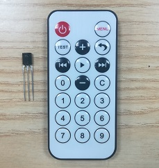
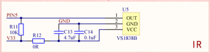
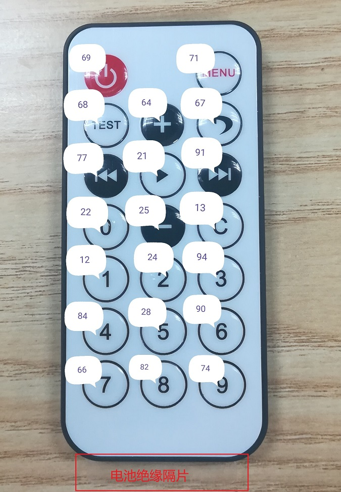

# 认识红外遥控器，红外编解码 #

## 温馨提示 ##
- 本节课程讲述红外遥控使用和调试的整体流程，请读者认真学习。
- 初学者不建议直接导入例程，最好自己建立新工程编写程序，调试。
- 在今后工程中遇到与本课相关的问题，请参照本节课程。
- 红外遥控模块详细介绍的链接有广告打开的时候请您注意。
- 在运行程序前请您先按复位，否则可能会报错。
- 在编写程序前请先添加标准库。
- 为了增加遥控电池使用寿命，每个遥控尾部都加有电池绝缘隔片。使用时，一定要把遥控尾部绝缘隔片拔出，否则无法使用遥控器。
## 第一节、简介 ##
　　实物图：

　　红外遥控是一种无线、非接触控制技术，具有抗干扰能力强，信息传输可靠，功耗低，成本低，易实现等显著优点。红外遥控的发射电路是采用红外发光二极管来发出经过调制的红外光波；红外接收电路由红外接收二极管、三极管或硅光电池组成，它们将红外发射器发射的红外光转换为相应的电信号，再送后置放大器。

## 第二节、外设功能框图分析 ##

　　原理图：

　　红外接收头采用的是1-Wire总线，是一个简单的信号传输电路，可通过一根共用的数据线实现主控制器与一个或一个以上从器件之间的半双工双向通信。

## 第三节、代码讲解 ##
	import java.io.IOException;
	
	import tijos.framework.devicecenter.TiGPIO;
	import tijos.framework.devicecenter.TiI2CMaster;
	import tijos.framework.sensor.vs1838b.ITiVS1838BNECEventListener;
	import tijos.framework.sensor.vs1838b.TiVS1838BNEC;
	import tijos.framework.transducer.oled.TiOLED_UG2864;
	
	/**
	 * 监听类
	 * 
	 * @author tijos
	 *
	 */
	class IRDecodeListener implements ITiVS1838BNECEventListener {
		TiOLED_UG2864 _oled;
	
		// 构造
		public IRDecodeListener(TiOLED_UG2864 oled) {
			this._oled = oled;
		}
	
		@Override
		public void cmdReceived(TiVS1838BNEC arg0) {
			try {
				this._oled.print(2, 0, "IR: COMMAND=" + arg0.getCommand());
				this._oled.print(3, 0, "IR: ADDRESS=" + arg0.getAddress());
			} catch (IOException e) {
				e.printStackTrace();
			}
		}
	
		@Override
		public void cmdRepeat(TiVS1838BNEC arg0) {
		}
	
	}
	
	/**
	 * 认识红外遥控器，红外编解码
	 * 
	 * @author tijos
	 *
	 */
	public class IRDecode {
	
		public static void main(String[] args) {
			
			try {
				// GPIO资源分配，GPIO0的PIN5脚
				TiGPIO gpio0 = TiGPIO.open(0, 5);
				// I2C主机总线资源分配，I2C PORT0
				TiI2CMaster i2cm0 = TiI2CMaster.open(0);
				// I2C主机总线资源与屏幕对象绑定，屏幕地址：0x3C			
				TiOLED_UG2864 oled = new TiOLED_UG2864(i2cm0, 0x3c);
				// GPIO总线资源与红外解码对象绑定
				TiVS1838BNEC vs1838b = new TiVS1838BNEC(gpio0, 5);
				// 屏幕开启并清屏
				oled.turnOn();
				oled.clear();
				// 显示标题
				oled.print(0, 0, "IRDecode.");
				// 创建红外解码监听者，并传入屏幕实例
				IRDecodeListener lc = new IRDecodeListener(oled);
				// 设置红外解码事件监听者
				vs1838b.setEventListener(lc);
	
				while (true) {
				}
			} catch (IOException e) {
				e.printStackTrace();
			}
		}
	
	}

## 第四节、实验现象 ##

　　按下遥控器按键，液晶屏显示遥控器对应按键的解码值。遥控按键对应解码值如下：

## 第五节、参考资料 ##

　　红外接收头，详细介绍：https://baike.baidu.com/item/红外接收头/9569261

　　红外遥控模块详解：http://www.elecfans.com/tongxin/tongxinmokuai/2018/0518/679151.html

　　访问总线介绍:http://dev.tijos.net/docstore/tijos-development-guide/tijos.framework.devicecenter.TiOWMaster/

