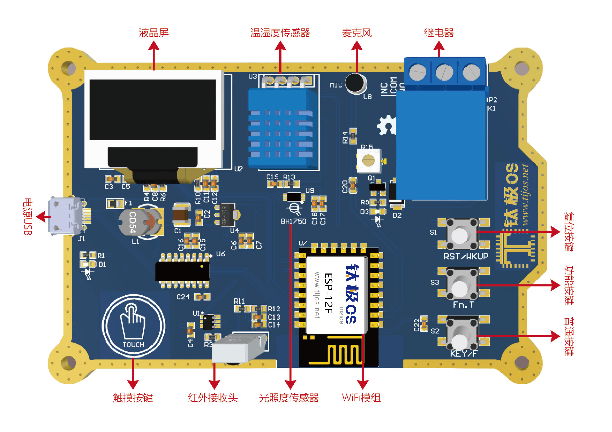
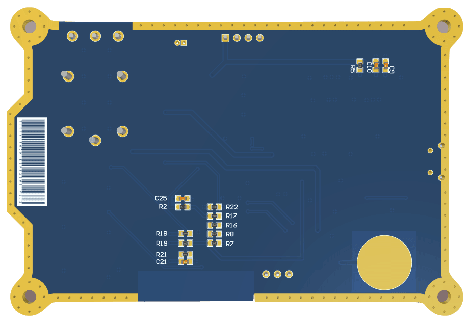
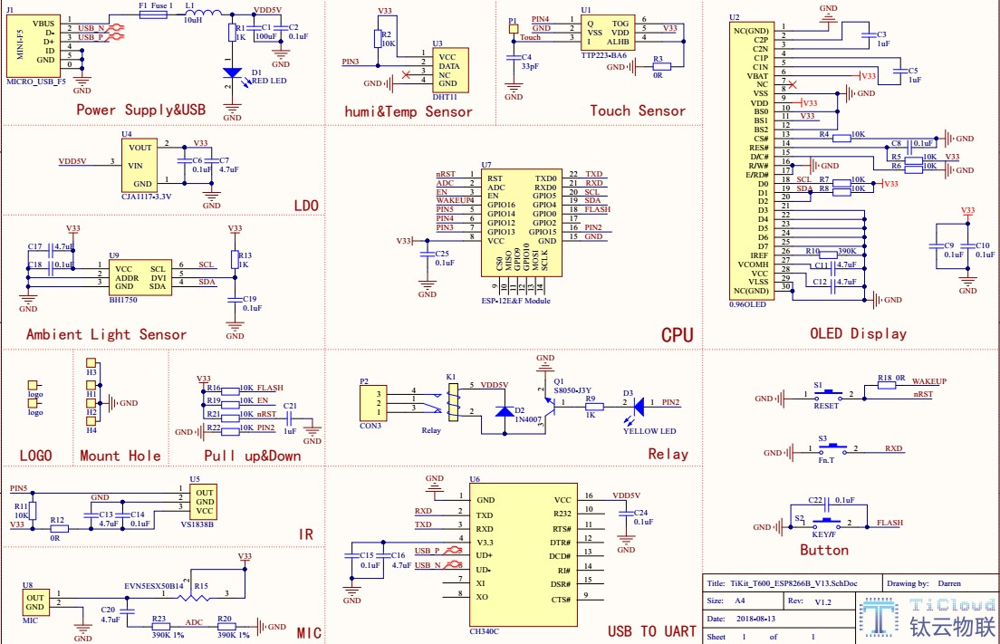
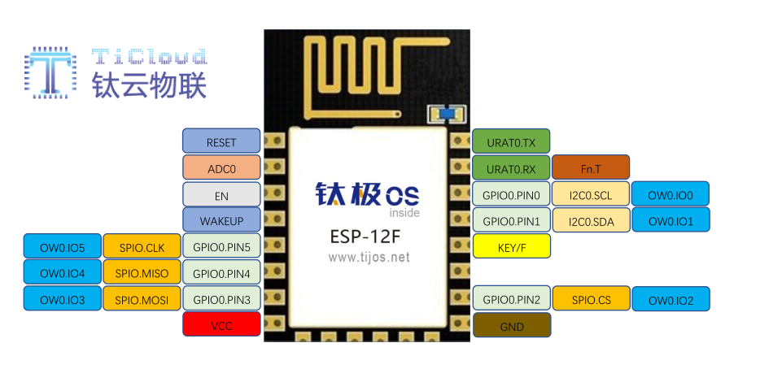
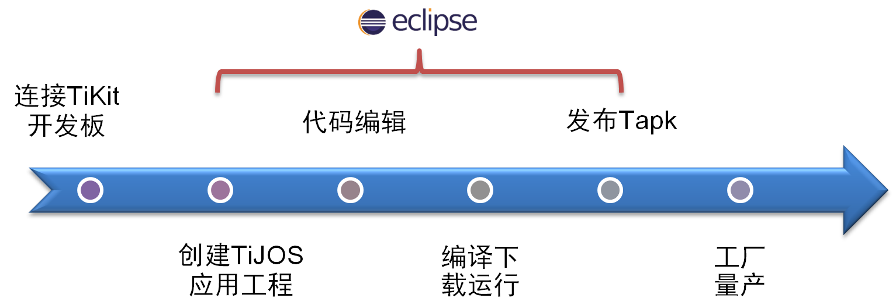

# 钛极小龟与驾驭之术—开发板与开发环境简介 #

## 温馨提示 ##

- 如果使用学习时出现莫名其妙的错误，可以先在网上查找解决问题的方法，也可以在钛云物联论坛上发帖和相关技术人员沟通，莫要急于处理。
- 学习实用过程中：一、不需要全面理解，对其整体有大概认识即可；二、不需要死记硬背，一切理论都要经过动手练习才能成为自己的技术。

## 一、神奇的钛极小龟—开发板简介绍 ##

　　钛极小龟开发板是针对初学者推出的整套开发板套件，不支持外接设备，如想要外接设备，请购买相应的开发板。

### 钛极小龟登场—实物图 ###

　　正面：

　　反面：

### 钛极小龟现原形—电路图与CPU ###

　　电路图：

　　CPU资源（ESP-12E/F模块）：

　　ESP8266高性能微处理器为乐鑫信息科技(上海)有限公司(Espressif Systems (Shanghai) Pte., Ltd.)Ltd针对物联网行业打造的一款低功耗低成本的MCU，详细资料请访问官方网址：**http://espressif.com/**

### 钛极小龟展神威—自带的功能 ###
 
　　1.终端打印         
　　2.液晶屏显示     
　　3.普通按键控制   
　　4.触摸按键控制               
　　5.温湿度采集   
　　6.光照度采集    
　　7.继电器开关控制  
　　8.噪声控制     
　　9.红外遥控控制   
　　10.多应用  
　　11.多线程    
　　12.WIFI快速连接  
　　13.网络，TCP通讯技术    
　　14.物联云，MQTT通讯技术

## 二、驾驭之术—开发环境简介 ##

　　钛极OS是一个支持 Java 语言开发嵌入式智能硬件的物联网操作系统，支持大部分的Java特性，与标准Java兼容，并通过Eclipse进行开发，同时钛极OS还支持多应用。它的实现机制更像安卓、由内核掌管底层硬件资源，软硬隔离，同时集成高效的Java虚拟机，通过对硬件抽象，异步IO, 多线程、沙盒运行，事件驱动以及面向对象的Java语言开发等多种技术，使物联网硬件应用开发变得轻松且高效。

　　详细介绍链接如下：
**http://www.tijos.net/tijos/OSintroduce/**

　　整个开发过程与标准Java应用开发过程类似，具有基本Java开发经验即可开发硬件应用, 开发过程如下图所示:

    