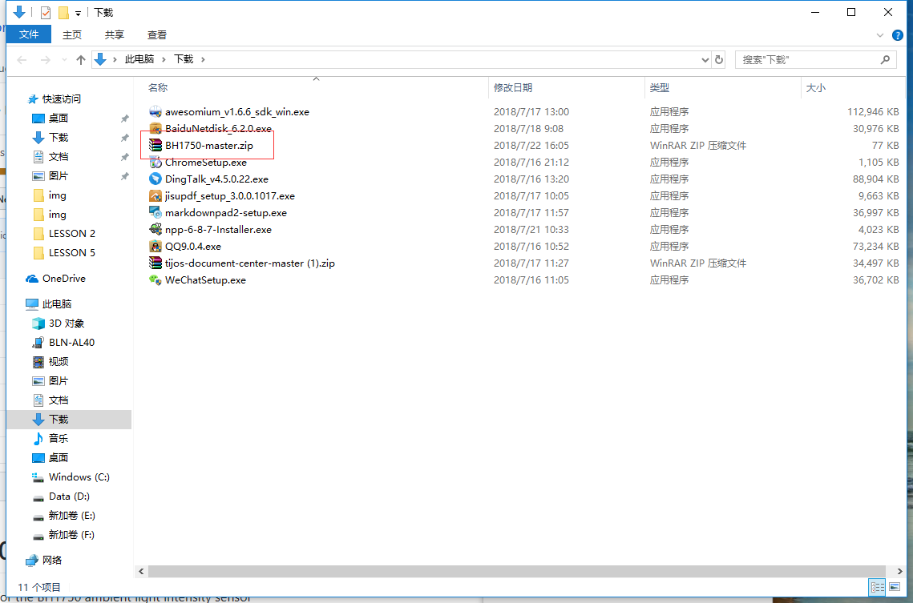
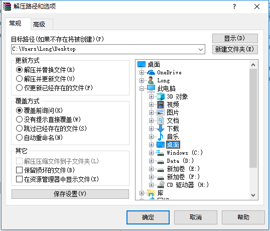
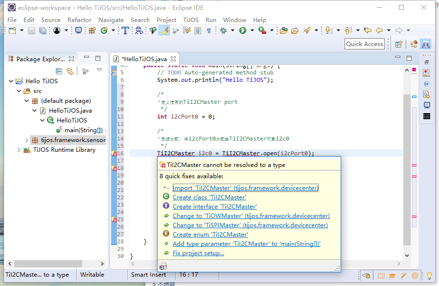

# 傻瓜式操作—快捷应用 #

## 温馨提示 ##

- 和读者分享一下Eclipse的快捷操作，使用小技巧，快速高效开发离不开软件的操作技巧。
- TiJOS开发平台为读者提供了标准库和驱动库，可以免费在网上下载，移植也很方便。
- 标准库包含基础的外设，接下来的基础课程基本上都需要用到标准库，基础课中遇到类似的操作，可以重新阅读本课程。

## 一、Eclipse使用小技巧 ##

　　**Eclipse** 是一个开放源代码的、基于Java的可扩展开发平台。就其本身而言，它只是一个框架和一组服务，用于通过插件组件构建开发环境。    
　　详细介绍链接如下：        
**https://baike.baidu.com/item/Eclipse/61703**  
　　使用技巧链接如下：             
**https://blog.csdn.net/tiantangdizhibuxiang/article/details/77256430**                                                         
**https://www.cnblogs.com/ning123/p/5954589.html**

## 一、标准库的添加 ##

　　新建工程没有带标准库，如果使用标准库，需要自己动手添加，添加过程如下：

　　选中Hello TiJOS工程右击，点击Properties（也可以用快捷键）。

　　选Java Build Path里的Classpath,点击Add Library。

　　选TiJOS Driver Library Classpath Container,点击Next。

　　选中TiJOS Driver Library,点击Finish。

　　点击Apply and Close。

　　如下图所示，标准库添加成功。

## 二、驱动库下载 ##

　　接下来我们公司推出的一系列外设驱动，都可以在里面找到并免费下载，库里都是可执行性程序，每个库里都包含一个驱动，一个例程。
　　下载地址：https://github.com/tijos-sensor-library

　　**下载过程如下：**

　　打开网址链接，如下图。

　　点击Download ZIP下载。

　　下载完成后，点击打开文件。

　　文件是个压缩包，如下图所示：

　　解压文件，并记住解压路径。

## 三、工程移植 ##

　　下载下来的库文件都是完整的工程，可以直接导入运行，导入详细过程在前面已经讲解过。

　　驱动包可以直接用鼠标拖入工程。

　　弹出如下对话框，点击OK。

　　驱动包已成功导入工程。

## 四、程序纠正 ##

　　驱动的导入后，程序可以直接写，不用考虑少驱动文件。出现错误不用担心，把光标拖到错误出会弹出改正方法。

　　点加入头文件，如下图，其他错误同理。

　　软件自动更正错误。

