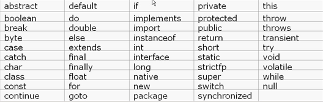
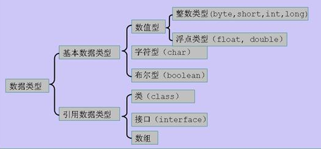

# 初识Java王国—基础知识讲解 #

## 温馨提示 ##
- 本节是参照博客内容对JAVA语言基础知识的简单讲解。
- 读者通过本节课程只能对JAVA有个大概认识，若想深入学习请参照相关书籍或网络资料。
- 推荐入门资源：http://www.cnblogs.com/xdp-gacl/p/3624567.html
- 推荐入门书籍：《JAVA基础入门》

## 一、标识符 ##
- Java对各种变量、方法和类等要素命名时使用的字符串序列称为标识符。  
    *凡是自己可以起名字的地方都叫标识符。
- Java标识符的命名规则：   
    *标识符由字母、下划线"_"、美元符“$”或数字组成。  
    *标识符应以字母、下划线、美元符开头。  
    *Java标识符大小写敏感，长度无限制。
- 约定俗称：Java标识符选取应注意“见名知意”且不能与Java语言的关键字重名。

## 二、关键字 

- Java中一些赋以特定的含义，用作专门用途的字符串称为关键字（keyword）。很多编译器都会将关键字用特殊方式标出。
- Java关键字都是小写英文字母。
- goto和const几乎不被使用，但也是关键字。  

## 三、常量和变量 ##
- Java常量值用字符串表示，区分不同的数据类型。还可以在其它语境中表示值不可变的变量。
- Java变量是程序中最基本的存储单元，其要素包括变量名、变量类型和作用域。属于特定的数据类型，在使用前需声明。

## 四、基础数据类型 ##
- Java数据类型的划分   

- Java中定义了4类8种基本数据类型。  
    *逻辑型——boolean   
    *文本型——char   
	*整数型——byte、short、int、long   
	*浮点数型——float、double

## 五、运算符 ##
- Java语言支持的运算符：

	算数运算符: +、-、*、/、%、++、--  
	关系运算符: >、<、>=、<=、==、!=  
	逻辑运算符: !、&、|、^、&&、||  
	位运算符：&、|、^、~、>>、<<、>>>  
	赋值运算符： =   
	扩展复制运算符： +=、-=、*=、/=   
	字符串连接运算符：+
	三目运算符： x?y:z

## 六、流程控制语句 ##
- **顺序结构：**按照写代码的顺序依次执行  

- **选择结构：**根据条件的不同有选择的执行不同的代码             

	*if    
	1、if(条件){语句块}   
   **执行流程：**先判断条件, 如果为真 则语句块执行，否则 语句块不执行  

     2、if(条件){语句块 1}   
     else{语句块2}   
   **执行流程：**先判断条件的真假, 如果为真 则只执行语句块1, 否则, 只执行语句块2  
    3、if(条件1){语句块1}  
    else if(条件2){语句块2}   
    else if(条件3){语句块3}   
    ...  
    else if(条件n){语句块n}   
    else{语句块n+1}      
   **执行流程：**先判断条件1，如果为真 则执行语句块1，执行完毕,跳出整个if结构执行if下面的语句， 否则判断条件2,如果条件2为真，则执行语句块2,执行完毕跳出，整个if结构执行if下面的语句， 如果条件2也为假，则判断条件3，如果为真... 如果判断到条件n都为假,则执行else中的语句块n+1   

	*switch  
	switch(表达式){     
	case 目标值1：语句块1 break;    
	case 目标值2：语句块2 break;   
	case 目标值3：语句块3 break;   
	...   
	case 目标值n：语句块n+1 break;   
	default：  
	语句块n+1 break;}            
 **执行流程：**先计算表达式的结果 A ,使用A顺次的与对应的目标值进行比较,一旦发现有相等的目标值, 就停止比较,执行对应的语句块, 再执行break跳出整个switch结构, 如果从上往下比较都没有目标值与A相等则执行语句块n+1 结束switch

- **循环结构：**根据条件的不同，有选择的执行某一片代码  

	*for  
	for(初始化语句;条件;步进表达式){循环体}  
   **执行流程：**  
   第一步：初始化语句  
   第二步：判断条件, 条件为真 进入第三步 ,条件为假进入第五步    
   第三步：执行循环体   
   第四步：执行步进表达式 进入第二步   
   第五步：结束循环

 	*while  
​    while(条件){循环体 步进语句}   
   **执行流程:**  
   第一步：初始化语句  
   第二步：判断条件, 条件为真, 进入第三步,条件为假, 进入第五步  
   第三步：执行循环体  
   第四步：执行步进语句, 再进入第二步   
   第五步：结束循环

	*do ... while   
	do{循环体 步进语句}while(条件)   
   **执行流程：**  
   第一步：初始化语句  
   第二步：执行循环体  
   第三步：执行步进语句  
   第四步：判断条件,如果条件为真,进入第二步, 否则进入第五步   
   第五步：结束循环
​    
   **跳转语句可以控制循环的执行：**  
   **break：**          
   在循环中使用的时候 表示结束当前循环  
   在switch语句中使用 表示跳出当前的switch结构   
   **continue：**   
   在循环中使用, 表示结束本次循环 进行下一次循环  
   跳转语句 脱离循环没有意义
​    
​     

