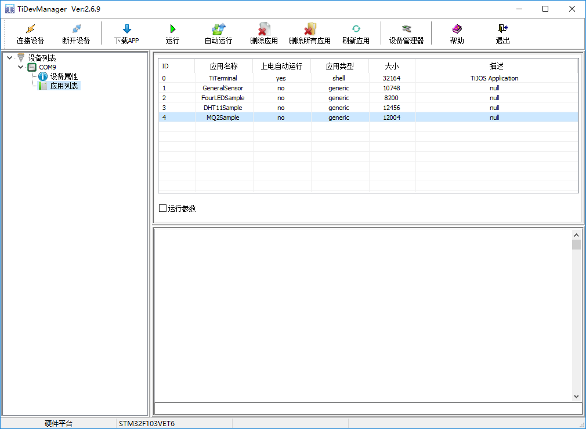

# TiDevManager 设备管理器使用说明

TiDevManager设备管理器是TiStudio一部分，无需单独安装, 该工具主要用于操作TiKit开发板进行设备诊断、配置、应用执行等功能, 支持所有型号的TiKit开发板，并会根据TiKit型号支持不同的属性设置，为用户提供统一测试开发工具。

TiDevManager设备管理器是TiKit的控制面板，可非常方便的对设备及应用进行管理和测试，包括：

- 通过应用下载端口与TiKit建立连接并获取设备信息
- 对TiKit开发板基础信息及网络进行设置
- 快速下载应用到TiKit开发板中并进行应用管理
- 运行TiKit开发板中应用并输出日志

钛极OS(TiJOS)应用开发主要在Eclipse中进行, TiDevManager只是方便用户进行设备的设置和诊断，在需要时使用即可。

## 注意

只有钛极OS(TiJOS)终端在运行时才能通过TiDevManager进行管理， 也即，当用户应用正在运行时，无法通过TiDevManager进行设备管理，此时可通过退出用户应用或手动进入钛极OS终端的方式进行， 具体可参考应用管理部分说明。

## 启动TiDevManager

安装TiStudio后可通过Eclipse工具导航菜单中点击红框图标打开TiDevManager工具，托盘显示如下图

## 连接TiKit开发板

将TiKit 连接到USB口之后， 可通过"连接设备"按钮选择TiKit的端口并进行连接

当TiDevManager连接到TiKit时，会自动加载设备信息并连接设备的日志打印口，如下图：

## 系统设置

### 设备属性

连接成功后，可通过设备属性显示设备的ID、版本、处理器、存储空间等信息。通过菜单栏可对设备进行连接、断开及应用管理等功能，如系统中识别多个设备，可通过连接设备来切换。

### 主机信息设置

通过设备属性页中的设置属性可进行主机信息设置，包括主机名称、日志等级及当前时间，如下图，

#### 日志输出控制

钛极OS(TiJOS)提供了日志类Logger, 可用于在应用中输出日志， 同时， 日志极别可通过TiDevManager进行设置以方便通过日志进行分析

输出日志等级，根据开发的过程设置输出相关日志

以上信息，修改后点击确定即可

#### 时间设置

设置主机当前RTC时间， 需支持电池供电。

### 网络设置

网络设置是TiDevManager的另一重要功能，网络设置通过设备属性进行设置， 可设置包括主机名称，WLAN, IP, DNS等， 如果支持AP， 还可设置AP相关的广播名称和连接密码等。

注意:网络设置在用户应用中通过TiWLAN启动网络连接时起作用，钛极OS(TiJOS)不会自动连接网络， 如果应用中用不到网络，也可不进行设置。

#### WLAN

类似于无线终端，本身并不接受无线的接入，它可以连接到AP，一般无线网卡即工作在该模式，设置SSID及密码，可自动获取IP地址，或手动填写指定IP、子网掩码、网关信息

#### AP

AP模式，提供无线接入服务，允许其它无线设备接入，提供数据访问，设置SSID及密码，IP、可自动获取IP地址，或手动填写指定IP、子网掩码、网关信息

#### DNS

首选DNS与备用DNS设置，如果没有更优的DNS可采用设备默认DNS

## 应用管理

### 应用列表

选择应用列表后，TiKit中的所有应用会列举出来，如下图所示：

### 下载应用

在开发过程中TiStudio会负责应用的自动下载和执行，当应用开发完成后，可能需要将应用发送给其他人进行测试，此时可通过TiStudio导出tapk应用文件，并通过TiDevManager手工下载并运行进行测试。

通过点击"下载APP"，选择要下载的应用tapk文件及应用ID， 如下图：

下载过程中请勿断开设备，以免造成下载失败， 应用ID已有应用将被覆盖。

### 运行应用

当需要运行指定应用时， 可在应用列表选中该应用，点击"运行"按钮即可.

如果该应用支持运行参数， 选中运行参数选择框后输入相应的参数后点击运行即可。

日志窗口会有日志输出，如下图：

日志可以保存成文件，也可输出到文件实时监测COM口数据输出，在日志窗口中右键，如下图：

设置日志输出：可将日志输出到临时目录的文件中，方便查看

### 设置自动运行指定应用

钛极OS(TiJOS)支持指定应用为上电自动运行， 设置后钛极OS(TiJOS)启动时会自动运行该应用， 一般用于设备产品化时上电自动运行指定的应用。

当需要返回钛极OS(TiJOS)终端时, 可通过按住TiKit开发板上红色"KEY"按钮再按黑色“RESET"铵钮来完成， 流程如下：

1. 按住红色"KEY"按键，不要放开
2. 按黑色"RESET"按键一秒后放开
3. 放开红色"KEY"按键，后进入钛极OS(TiJOS)终端， 此时可使用TiDevManager进行设备管理

### 删除应用

该按钮用于删除当前选中应用

### 删除所有应用

点击该按钮后，所有应用都将被删除。

## 常见问题

**问题1：通过设备管理器无法操作设备？**

**解决方法：**

设备未连接或模式不正确，通过下边两点进行判断：

（1）设备可能已断开，通过系统的设备管理器来判断，如下图：

端口中出现如上图，代表设备是正常的，其它即为失败连接

（2）设备当前可能在运行用户应用且未退出，可通过手工结束应用切换到钛极OS终端后通过设备管理器操作即可， 启动钛极OS终端方法：按住红色KEY按键，按一次黑色RESET按键，然后松开KEY按键即可

**问题2：如何安装应用下载端口及日志打印端口驱动？**

**解决方法：**

请从如下链接下载驱动文件进行安装即可

CP210X UART驱动: <http://www.silabs.com/documents/public/software/CP210x_Windows_Drivers.zip>

CH340 UART驱动: <http://www.wch.cn/download/CH341SER_EXE.html>

CP210X UART为应用下载端口，CH340 UAR为日志打印端口

**问题3：如何手动下载APP？**

**解决方法：**

设备必须切换到钛极OS终端应用，点击下载APP，选择编译成功的APP下载即可

