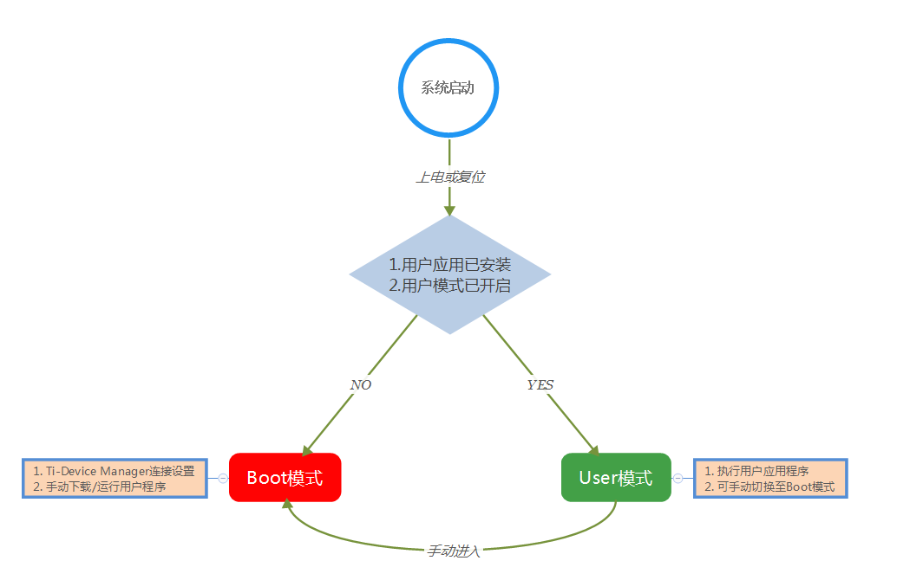
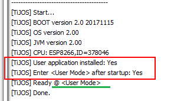
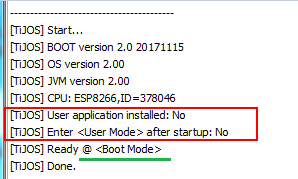
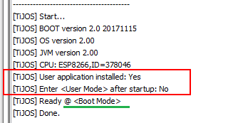
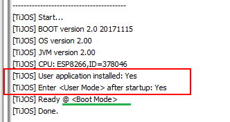

# 关于钛极OS(TiJOS)系统工作模式

## 简介

为了给用户提供一个方便快捷的操作系统管理策略，钛极OS(TiJOS)系统提供两种工作模式，分别是Boot模式（引导模式）和User模式（用户模式）。

## 工作模式定义

### Boot模式

**Boot模式**，即引导模式，此时只有系统Boot应用程序在运行，并接受上位机程序命令，用户可以使用TiDevManager设备管理工具对设备进行**配置**和**下载**/**运行**用户应用程序。**注：**用户可以将此模式类比成PC机的BIOS模式。

### User模式

**User模式**，即用户模式，此时只有**用户应用程序**在运行，执行应用程序所有业务逻辑。**注：**在此模式下，**不能**再通过TiDevManager设备管理工具进行配置和下载，需要手动让系统进入Boot模式。

## 应用场景

正如简介中所述，钛极OS(TiJOS)系统中引入工作模式的概念意在为用户提供方便快捷的操作系统管理策略，任何系统策略最终会在具体应用场景中体现，下面就详细讲解本系统工作模式的应用场景。

**Boot模式应用**，用户可以在该模式下通过TiDevManager设备管理工具对设备进行配置，如：主机名等。该模式主要在**开发阶段**使用，用于用户应用程序的下载和运行测试，在Eclipse中运行用户应用程序**必须**在该模式下进行。

**User模式应用**，进入该模式后，系统会自动启动已经安装的用户应用程序，该模式主要在程序业务逻辑都得到正确性验证后使用，即在**产品阶段**使用。

## 工作模式切换

如下图所示，钛极OS(TiJOS)系统的工作模式的切换分为**自动切换**和**手动切换**两种，系统在启动后首先判断**用户应用已经安装**与**用户模式已开启**两个条件是否同时成立，若同时成立，则自动进入User模式，并开始执行用户应用程序；否则就自动进入Boot模式，在此模式下系统等待TiDevManager设备管理工具的连接，进行设配属性设置、用户应用程序下载/运行等操作。

若当前工作模式为User模式，需要手动操作使其进入Boot模式。**手动进入方法为：**按住BOOT按钮，按一次RESET按钮，然后松开BOOT按钮。

## 工作模式判断

用户可以通过系统启动时打印的**系统日志**来判断系统当前工作在何种模式，下面将举例说明：

1. 如下图所示：

以上，用户应用程序已经安装，同时用户模式已经开启，对应日志中的Enter \<User Mode> after startup: Yes内容，故当前工作在User模式，接下来**用户应用**将会被启动。

2. 如下两个图所示：

以上，不满足启动User模式的两个条件，故当前工作在自动Boot模式。

3. 如下图所示：

以上是在User模式下手动进入Boot模式的系统日志，当前工作在手动Boot模式。

## 总结

以上详细讲解了钛极OS(TiJOS)系统工作模式的技术原理及使用方法，意在让用户快速理解并能合理运用，更多问题可访问[钛极OS(TiJOS)技术交流社区](http://bbs.tijos.net)进行讨论。