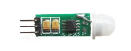

# 通用报警传感器类

tijos.framework.sensor.general通用传感器类提供对常见的不带通讯协议的传感器支持，这类传感器一般提供3个或4个外部连接线，包括VCC,GND, AO, DO. AO一般连接ADC用于获得传感器模拟量转为数字量的电压值， DO一般用于获得是否超过预置的阀值的电平，同时在超过阀值时通过DO管脚产生相应的中断.

钛极OS(TiJOS)通用传感器类该传感器类基于TiGPIO和TiADC设备总线驱动, 适用于一些常见报警类传感器，如温湿度传感器, 光线传感器，火焰传感器，等等， 同时也适用于按键传感器，该类型通过DO检测按键事件。


## 类名

通用传感器包括传感器类和传感器事件监听接口， 传感器类用于与设备总线资源进行绑定如GPIO, ADC等， 同时可获得当前AO,DO输出值；相对应的事件监听接口类似硬件中的中断，用于接收来自GPIO的中断事件。

| 类                             | 说明           |
| ----------------------------- | ------------ |
| TiGeneralSensor               | 通用传感器类       |
| ITiGeneralSensorEventListener | 通用传感器事件监听器接口 |


## 主要方法

### 传感器类-TiGeneralSensor

| 方法                                       | 说明                                       |      |
| ---------------------------------------- | ---------------------------------------- | ---- |
| 构造函数                                     |                                          |      |
| TiGeneralSensor(TiGPIO gpio, int signalPinID) | 资源绑定, 通过指定GPIO设备总线资源对象及连接DO的管脚PIN ID初始化对象， 该方法适用于只有DO，不带ADC的传感器，如按键。 |      |
| TiGeneralSensor(TiGPIO gpio, int signalPinID, TiADC adc) | 资源绑定, 通过指定GPIO设备总线资源对象及连接DO的管脚PIN ID和ADC对象来初始化对象，该方法适用于同时包含DO,AO的传感器，如报警类传感器。 |      |
| 获取DO, AO                                 |                                          |      |
| double getAnalogOutput()                 | 获取当前AO输出值                                |      |
| int getDigitalOutput()                   | 获取当前DO输出值(0或1)                           |      |
|                                          |                                          |      |

### 传感器事件接口监听器-ITiGeneralSensorEventListener

| 方法                                       | 说明                          |
| ---------------------------------------- | --------------------------- |
| onThresholdNotify(TiGeneralSensor sensor) | 事件回调方法，当有GPIO中断发生时，该方法即可被调用 |

在实际应用中监听GPIO中断事件时，需要实现此接口中的方法并通过TiGeneralSensor中的setEventListener方法将事件与传感器类挂接，这样当对应管脚发生中断时， 该方法将被调用。

## 使用方法

TiGeneralSensor通过传感器类的使用遵循钛极OS(TiJOS)的传感器应用开发原则，通过“资源分配”，“资源绑定", "资源使用"三个步骤来进行， 详情可参考[TiJOS传感器应用开发指南](http://dev.tijos.net/manual/tijos_framework_guide/tijos_sensor_application_guide/).

### 资源分配

资源分配即打开该传感器用到的设备总线资源， TiGeneralSenosr依赖于TiGIPO和TiADC总线资源，因此在使用之前需要先分配相应的资源。

假设我们使用TiKit开发板的GPIO的PIN0管脚和模数转换器ADC0分别连接传感器的DO和AO，资源分配代码如下：

```java
/*
* 定义使用的TiGPIO port
* 定义使用的TiADC port
*/
int adcPort0 = 0; //ADC总线0
int gpioPort0 = 0;//GPIO总线0
/*
* 定义所使用的gpioPin
*/
int gpioPin0 = 0;
/*
* 资源分配，
* 将gpioPort与gpioPin0分配给TiGPIO对象gpio0
* 将adcPort0分配给TiADC对象adc0
*/
TiGPIO gpio0 = TiGPIO.open(gpioPort0, gpioPin0);
TiADC adc0 = TiADC.open(adcPort0);
```

### 资源绑定

资源绑定即使用分配的总线对象初始化传感器对象：

```java
/*
* 资源绑定，
* 创建TiGeneralSensor对象generalSensor并将gpioPort、gpioPortPin和adcPort与其绑定
* 即该传感器使用芯片上GPIO总线编号0的PIN0管脚和ADC总线编号0的资源
* Pin0<---->DO
* ADC <---->AO
*/	
TiGeneralSensor generalSensor = new TiGeneralSensor(gpio0, gpioPin0, adc0);
```

### 资源使用

在完成资源绑定后即可使用该传感器对象获取实际的传感器信息，此类传感器一般支持预置阀值，当被测参数超过阀值时在DO产生中断，如果希望监控相应的中断事件，则需要定义一个实现ITiGeneralSensorEventListener的事件监控类， 当中断发生时onEvent方法将被调用，此时可在该方法中加入处理中断的代码。

```java
//事件监听器
class GeneralSensorEventListener implements ITiGeneralSensorEventListener {

	@Override
	public void onThresholdNotify(TiGeneralSensor sensor) {
		System.out.println("onThresholdNotify ");
	}
}

```

在应用中创建该监听对象后，设置到对应的TiGeneralSensor对象中

```java
/* 创建事件监听对象并设置事件监听
* 在事件监听中处理事件逻辑
*/			
GeneralSensorEventListener lc = new GeneralSensorEventListener();
generalSensor.setEventListener(lc);
```

以上设置完成后， 可随时获取DO和AO的值，也可在中断事件发生去获取相关的值

```java
//获取AO
double vol = generalSensor.getAnalogOutput();
System.out.println("Votagel: " + vol);

//获取DO
if(generalSensor.getDigitalOutput() == 1)
{
  System.out.println("high");
}
else
{
  System.out.println("low");
}
```

这样即可在实际应用中使用通用传感器来获取相关信息了。

## 注意事项

1. TiGPIO和TiADC所对应的port是钛极OS(TiJOS)中对芯片资源逻辑定义，可理解为该类似资源ID。
2. 设备总线资源与相应的TiKit支持的资源有关, 在使用前请注意检查是否支持该资源。
3. 监听器中事件在GPIO中断上升沿和下降沿都会被调用, 在实际使用时在事件发生时可通过getDigitalOutput来获取当前DO的实际状态。
4. 由于中断是一个瞬时事件，有可能在事件函数调用时外界环境已经发生变化，因此在实际应用中建议在事件发生时同时通过DO,AO的实际情况来确定下一步的动作。
5. 在事件函数如果需要执行耗时较长的操作时， 建议设置一个变量在主线程中处理或另开启一个线程进行处理以避免后续事件无法快速被处理。

## 相关例程

我们提供了基于TiGeneralSensor的常见传感器例程供用户参考, 具体请查看GeneralSensor相关例程。

| 传感器     |                    图片                    | 例程                                 |
| ------- | :--------------------------------------: | :--------------------------------- |
| 火焰传感器   |     | FireSensorSample.java              |
| 光敏传感器   |   | LightSensorEventListener.java      |
| 声音传感器   |   | SoundSensorEventListener.java      |
| 土壤湿度传感器 |     | SoilSensorSample.java              |
| 触摸按键    |   | TouchButtonSample.java             |
| 人体感应开关  |   | HumanSensorSample.java             |
| 测速传感器   |   | SpeedSensorSample.java             |
| 寻迹模块    | . | TrackerSensorSample.java           |
| 避障传感器   |  | ObstacleAvoidanceSensorSample.java |

