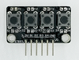
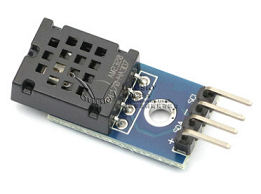
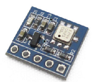
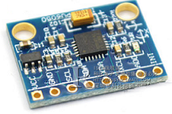
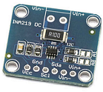
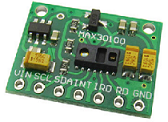
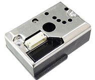
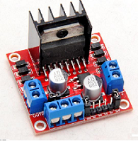

# 钛极OS(TiJOS)传感器支持说明

## TiKit开发套件中的传感器列表
TiKit 开发套件中提供给用户10余传感器进行学习和测试，包括：

| 传感器模块名称                                          | Java Class                                     | 型号           |                   图片                    |
| ------------------------------------------------------- | ---------------------------------------------- | -------------- | :---------------------------------------: |
| [按键模块](tijos.framework.sensor.button.md)            | tijos.framework.sensor.button.TiButton         | 通用           |            |
| [LED灯模块](tijos.framework.transducer.led.md)          | tijos.framework.transducer.led.TiLED           | 通用           |                  |
| [三基色灯模块](tijos.framework.transducer.led.md)       | tijos.framework.transducer.led.TiRGBLED        | 通用           |            |
| [OLED12864显示模块](tijos.framework.transducer.led.md)  | tijos.framework.transducer.oled.TiOLED_UG2864  | UG2864         |  |
| [单通道继电器模块](tijos.framework.transducer.relay.md) | tijos.framework.transducer.relay.TiRelay1CH    | 通用           |        |
| [可燃气体浓度检测模块](tijos.framework.sensor.mq.md)    | tijos.framework.sensor.mq.TiMQ                 | MQ-2           |                  |
| [数字温湿度采集模块](tijos.framework.sensor.dht.md)     | tijos.framework.sensor.dht.TiDHT               | DHT11          |              |
| [数字温度采集模块](tijos.framework.sensor.ds18b20.md)   | tijos.framework.sensor.ds18b20.TiDS18B20       | DS18B20        |          |
| [有源蜂鸣器模块](tijos.framework.transducer.buzzer.md)  | tijos.framework.transducer.buzzer.TiBuzzer     | 通用           |            |
| [红外接收模块](tijos.framework.sensor.vs1838b.md)       | tijos.framework.sensor.vs1838b.TiVS1838BNEC    | VS1838B        |        |
| [超声波测距模块](tijos.framework.sensor.hcsr.md)        | tijos.framework.sensor.hscr.TiHSCR04           | HCSR04/HCSR04+ |            |
| [通用传感器](tijos.framework.sensor.general.md)         | tijos.framework.sensor.general.TiGeneralSensor | 通用           |               通用4线传感器               |

## 更多开源传感器驱动支持

钛极OS(TiJOS)提供了更多传感器驱动支持，并对源码进行了开放, 用户可在如下链接找到相关的驱动支持并可根据对应的源码开发自己的驱动， 更多驱动在陆续增加中。

<https://github.com/tijos-sensor-library>

### 基础传感器

| 传感器            | 说明               | 通讯   | Class         |                    图片                    |
| -------------- | ---------------- | ---- | ------------- | :--------------------------------------: |
| 按键模块           | 通用               | GPIO | TiButton      |           |
| LED灯模块         | 通用               | GPIO | TiLED         |                 |
| 三基色灯模块         | 通用               | PWM  | TiRGBLED      |           |
| OLED12864显示模块  | 适用于UG2864 OLED屏幕 | I2C  | TiOLED_UG2864 |  |
| 单通道继电器         | 通用               | GPIO | TiRelay1CH    |       |
| MQt系列气体传感器     | 适用于MQ系统气体传感器     | ADC  | TiMQ          |                 |
| DHT11数字温湿度传感器  | 适用于DHT11温湿度传感器   | GPIO | TiDHT         |             |
| DS18B20数字温度传感器 | 适用于DS18B20传感器    | OW   | TiDS18B20     |         |
| 有源蜂鸣器模块        | 通用               | GPIO | TiBuzzer      |           |
| VS1838B红外接收模块  | VS1838B 红外接收模块   | IR   | TiVS1838BNEC  |       |
| HC-SR04超声波测距模块 | 适用于HC-SR04超起测距模块 | GPIO | TiHCSR04      |           |

### 通用传感器 (GPIO + ADC)

均可通过TiGeneralSensor.java 类来支持

| 传感器            | 说明                              |                   图片                    |
| -------------- | ------------------------------- | :-------------------------------------: |
| 火焰传感器          | 火源探测模块红外接收 火光检测报警               |    |
| 光敏传感器          | 光敏二极管传感器模块 可见光传感器 灵敏度可调 光照亮度传感器 |  |
| 声音传感器          | 高感度麦克风传感器模块 高灵敏声音控制板模块          |  |
| 土壤湿度传感 器       | 土壤传感器 土壤湿度传感器 土壤湿度计检测模块         |    |
| 触摸按键           | 触摸传感器模块 轻触开关 触摸开关 触摸模块          |  |
| HC-SR505人体感应开关 | HC-SR505小型人体感应模块                |  |

### 高级传感器

| 驱动                | 说明                          | 通讯   | Class             |                                     |
| ----------------- | --------------------------- | ---- | ----------------- | ----------------------------------- |
| AM2320数字温湿度传感器模块  | 该驱动适用于AM2320系列温湿度传感器        | I2C  | TiAM2320.java     |          |
| BMP180温度气压传感器     | 该驱动适用于BOSCH BMP180 温度气压传感器  | I2C  | TiBMP180.java     |          |
| MPU6050 三轴加速度 陀螺仪 | 该驱动适用于MPU6050 三轴加速度陀螺仪      | I2C  | TiMPU6050.java    |        |
| INA219 电流电源监控传感器  | 该驱动适用于INA219 双向电流／电源监控传感器   | I2C  | TiINA219.java     |          |
| MAX30100 心率血氧传感器  | 该驱动适用于Maxim MAX30100心率血氧传感器 | I2C  | TiMAX30100.java   |      |
| GP2Y1010AU灰尘传感器   | 该驱动适用于GP2Y1010AU系列灰尘传感器     | ADC  | TiGP2Y1010AU.java |  |
| L298N 电机驱动器       | 该驱动适用于 L298N 电机驱动器          | PWM  | TiL298N.java      |            |
