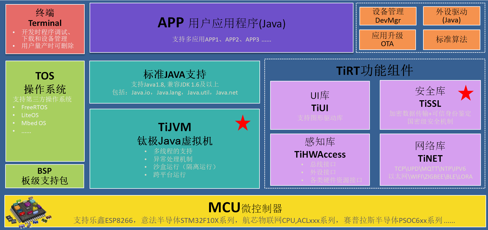
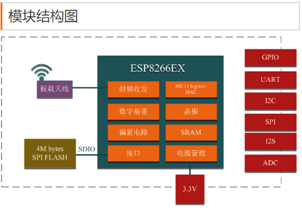

# **钛极OS介绍**

钛极OS是一个支持 Java 语言开发嵌入式智能硬件的物联网操作系统，支持大部分的Java特性，与标准Java兼容，并通过Eclipse进行开发，同时钛极OS还支持多应用。它的实现机制更像安卓、由内核掌管底层硬件资源，软硬隔离，同时集成高效的Java虚拟机，通过对硬件抽象，异步IO, 多线程、沙盒运行，事件驱动以及面向对象的Java语言开发等多种技术，使物联网硬件应用开发变得轻松且高效。

## **一、钛极OS的组成**

钛极OS由操作系统(TOS)、Java虚拟机(TiJVM)、功能组件(TiRT)三部分构成。

- TOS负责提供任务调度和控制、文件操作、基准时钟、资源的分配、外设操作(GPIO/UART...)等基础服务。同时钛极OS的特点是内核OS支持第三方的RTOS，例如LiteOS、FreeRTOS等。

- TiJVM的作用是建立Java程序的运行环境，实现Java语言的各种特性，同时TiJVM也是TOS的一个任务。

- TiRT是为用户开发应用程序提供的基础类支持，包括感知层控制、网络通信协议、为物联网的安全接入和身份鉴别提供的安全组件、图形组件包。

详细结构请见下图：

## **二、钛极OS的主要特点**

### 支持低资源MCU

- 标准Java1.8语法特性,兼容JDK1.6及以上
- 内核资源  ROM ≥ 32K,RAM≥8K 
- 已支持乐鑫ESP8266、意法半导体的STM32系列
- 支持第三方OS内核，如mBed OS，LiteOS，FreeRTOS等

### 引入Java虚拟机

- 通用：全球第一大开发语言,受众广泛
- 简单：类似于C语言,海量资源,零学习成本
- 高效：面向对象编程、多线程支持
- 健壮：异常处理机制支持
- 安全：屏蔽指针、内存回收机制、沙盒运行

### 软件定义硬件

- 通过对硬件抽象，异步 I/O 模型，实现软硬隔离，开发工程师不需要了解硬件工作原理，只需要通过JDK访问硬件资源，操作各类传感器、通信模块、硬件外设等

### 应用组件丰富

钛极OS拥有丰富的资源包，它解决了目前MCU应用开发流程过于繁杂的难题。由感知层、网络层、安全层、UI层，实现硬件开发中的IO输入输出控制、物联网协议移植、通信安全和设备合法性验证、常用的图形工具等。让物联网硬件开发不再从零做起，编程像搭积木一样简单。

## **三、钛极OS的基本特性**

### 兼容标准Java特性

- 支持Java1.8,兼容JDK 1.6及以上
- 自动垃圾回收
- 面向对象
- 多线程, 同步
- 流
- 集合
- …

### 不支持的Java特性

由于硬件资源所限，部分Java高级特性目前暂不支持，这些特性基本不会影响用户的应用开发，包括：

- 反射
- 序列化
- 正则表达式: 可使用字符串相关的操作函数来实现相应的功能
- Locale
- finalize: 不要在对象的finalize方法中执行代码，此方法不会被调用到

### 支持的标准Java包

标准JDK1.6Java包兼容: Java.io, Java.lang, Java.util, Java.net, …

## 四、钛极OS应用开发

整个开发过程与标准Java应用开发过程类似，具有基本Java开发经验即可开发硬件应用。开发者不需要考虑硬件平台、底层操作，面向硬件层全部由操作系统提供Java类操作。网站提供大量学习文档，完善的开发工具，github上有开源文件，开发者社区提供工程师交流和提问平台，专业人员为你答疑解惑。

## 五、钛极OS支持的CPU

### 乐鑫ESP8266

建议直接使用ESP8266F12模块；

详见：[TiKit-T600-ESP8266A 开发套件](../tikit/tikit-t600-esp8266/index.md)

### 意法半导体STM32F103

详见：[TiKit-T800-STM32F103A 开发套件](../tikit/tikit-t800-stm32f103/index.md)