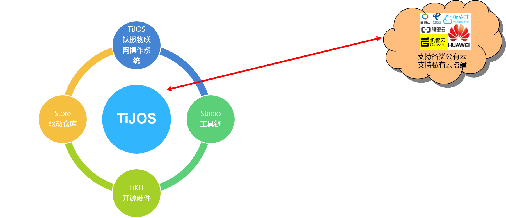

# 钛极OS简介

## 一、钛极OS及公司简介

　　钛极OS(TiJOS)是北京钛云物联科技有限公司研发的核心技术，是一个支持使用Java开发物联网应用的操作系统，支持大部分的Java特性，与标准Java兼容，并通过Eclipse进行开发。其面向对象的编程特点和丰富的组件资源，不仅降低了物联网端侧开发难度，还将众多的Java开发者引入物联网智能硬件开发的蓝海，帮助企业与开发者更轻松、高效地构建物联网智能硬件，可以把常规3个月的开发周期，缩短到半个月。               
　　北京钛云物联科技有限公司位于清华同方科技大厦，创始团队源于清华大学和国内著名安全公司，长期从事操作系统和嵌入式开发等领域研究。在物联网的“端、管、云”构架中专注于“端”侧技术研究和应用。基于钛极OS技术，公司推出一系列无线领域的产品解决方案，包含NB-IoT系列、WIFI系列、LORA系列、Zigbee系列、4G系列和蓝牙系列等等；具体落地项目有钛极智能NB远传水表、钛极可编程数传控制器、TiKit系列开发套件等等。

  

## 二、钛极OS(TiJOS)物联网操作系统组成

　　钛极OS(TiJOS)物联网操作系统组成专注于物联网行业的“端”侧开发，从物感知、物接入到物应用开发提供一站式解决方案，打通传感器信息采集到云端的全部开发环节。由钛极OS、钛极工具链、钛极驱动仓库、钛极开源硬件四部分构成。其中钛极OS是一个基于Java开发物联网智能硬件应用的物联网操作系统，像安卓一样可以让工程师无需关心底层技术实现，就像开发手机应用一样，使用Java开发物联网应用；钛极驱动仓库集成了常用传感器、通讯模组的驱动及源码，支持多家云平台的接入方案，用户专注于应用；钛极工具链指的是TiJOS的开发环境，包含编译器、设备管理器等，无需下载器，一根usb线完成开发；钛极开源硬件包含教学开发套件和物联网产品主板，有钛极开源硬件平台用户只需要调用JDK中提供的传感器及系统操作接口就可以轻松快速的完成产品雏形的开发。

 

## 三、钛极OS(TiJOS)物联网操作系统兼容性

　　钛极OS(TiJOS)物联网操作系统引入Java语言面向事件编程、跨平台、屏蔽指针、内存回收、沙盒运行和海量资源的特点，针对物联网的物感知和物接入需求，提供常用传感器、通讯协议、云平台接入方案的标准化的驱动和开源例程，类似于arduino，它解决了目前MCU应用开发流程过于繁杂、工程师需要一个一个模块去编写代码，存在重复造轮子的问题。让物联网开发不再从零做起，编程像搭积木一样简单。不仅降低了物联网“端”侧开发难度，还将众多的Java开发者引入物联网硬件开发的蓝海，帮助企业与开发者更轻松、高效地构建物联网产品，可以缩减60%开发工作量，为企业降低成本！

 

## 四、钛极OS(TiJOS)物联网操作系统本质

　　钛极OS(TiJOS)物联网操作系统是一个C语言和Java语言完美结合的产品，底层采用C语言实现、应用层使用Java进行开发。通过JNI实现JVM（java）和RTOS（c）的交互，实现硬件完美兼容JAVA编写的业务逻辑应用。且支持OTA技术，支持多应用，可以在不影响客户正常使用的空闲时间实现应用APP的更新。

 

​             

五、钛极OS(TiJOS)物联网操作系统的平台技术框架

钛极OS由操作系统(TOS)、Java虚拟机(TiJVM)、功能组件(TiRT)三部分构成。

- TOS负责提供任务调度和控制、文件操作、基准时钟、资源的分配、外设操作(GPIO/UART...)等基础服务。同时钛极OS的特点是内核OS支持第三方的RTOS，例如LiteOS、FreeRTOS等。
- TiJVM的作用是建立Java程序的运行环境，实现Java语言的各种特性，同时TiJVM也是TOS的一个任务。
- TiRT是为用户开发应用程序提供的基础类支持，包括感知层控制、网络通信协议、为物联网的安全接入和身份鉴别提供的安全组件、图形组件包。

详细结构请见下图：

 

## 五、钛极OS的基本特性

　　1、支持低资源MCU         
　　标准Java1.8语法特性,兼容JDK1.6及以上          
　　内核资源  ROM ≥ 32K, RAM≥8K           
　　支持第三方RTOS,如LiteOS，FreeRTOS等         
　　支持eclipse下开发和调试        
　　操作系统OS分离式开发方式

　　2、应用组件丰富    
　　标准java库支持       
　　TiJOS Framework        
　　安全类库         
　　互联互通类库            
　　钛极驱动仓库组件支持        

　　3、引入Java虚拟机          
　　通用：全球第一大开发语言,受众广泛       
　　简单：类似于C语言,海量资源,零学习成本           
　　高效：面向对象编程,多线程支持           
　　健壮：异常处理机制支持         
　　安全：屏蔽指针,内存回收机制,沙盒运行     

　　4、软件定义硬件             
　　通过对硬件抽象，异步 I/O 模型，实现软硬隔离，开发工程师不需要了解硬件工作原理，只需要通过JDK访问硬件资源，操作各类传感器、通信模块、硬件外设等

　　5、兼容标准Java特性

　　支持Java1.8,兼容JDK 1.6及以上

　　自动垃圾回收

　　面向对象

　　多线程, 同步

　　流

　　集合

　　…

　　6、不支持的Java特性

　　由于硬件资源所限，部分Java高级特性目前暂不支持，这些特性基本不会影响用户的应用开发，包括：

　　反射

　　序列化

　　正则表达式: 可使用字符串相关的操作函数来实现相应的功能

　　Locale

　　finalize: 不要在对象的finalize方法中执行代码，此方法不会被调用到

## 六、钛极OS应用开发

　　整个开发过程与标准Java应用开发过程类似，具有基本Java开发经验即可开发硬件应用。开发者不需要考虑硬件平台、底层操作，面向硬件层全部由操作系统提供Java类操作。网站提供大量学习文档，完善的开发工具，github上有开源文件，开发者社区提供工程师交流平台，专业人员为你答疑解惑。

## 七、TiKit 开发平台

TiKit开发平台是用于学习钛极OS(TiJOS)物联网操作系统的实验设备，配套有主板、多种传感器模块，实验程序源码，学习资料等。

### 乐鑫ESP8266/8285

详见：[钛极小龟WIFI版(TiKit-T600-ESP8266B) 开发套件](../tikit/tikit-t600-esp8266B/index.md)

### 意法半导体STM32

详见：[钛极小龟NB-IoT版(1+1) TiKit-T800-STM32F103B 开发套件](../tikit/tikit-t800-stm32f103B/index.md)

### 联发科MTK2625 NB-IoT模组

