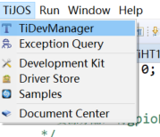
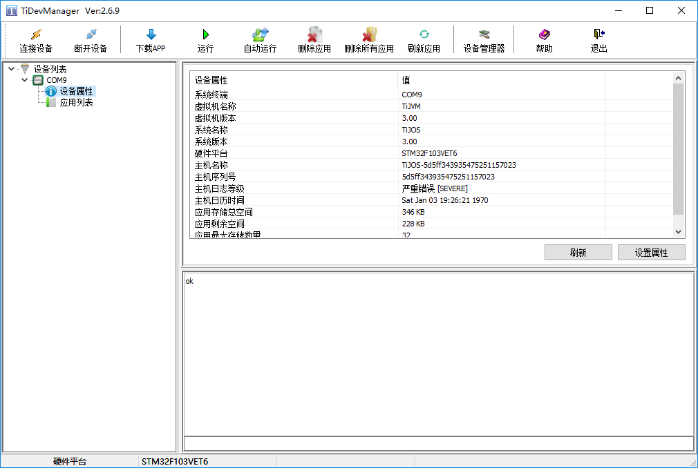

# 钛极OS(TiJOS)应用开发环境搭建

钛极OS(TiJOS)应用开发环境只需在Eclipse中在线安装TiStudio插件即可，安装成功后即可在Eclipse中进行TiJOS应用的开发和运行，Eclipse中TiStudio插件安装路径http://dev.tijos.net/studio/release, 按Eclipse标准插件安装流程进行安装即可。具体过程如下：

## 开发平台支持

最低要求：Windows 7及以上

## 安装Eclipse

TiJOS应用与标准Java 应用类似，通过在Eclipse中安装TiStudio插件即可通过Eclipse进行TiJOS应用的开发和调试，Eclipse可在<http://www.eclipse.org/downloads/> 下载。

如果您已安装Eclipse, 可直接安装TiStuido即可。

Eclipse版本支持：4.6 及以上

## 安装TiStudio

在Eclipse中通过Help菜单下的"Install New Software" 安装TiStuido 插件, 安装过程如下:

1. 从Eclipse菜单"Help"下选择"Install New Software"

   

2. 从弹出的Install对话框中选择"Add"按钮后弹出“Add Repository"后，填写TiStudio的插件url http://dev.tijos.net/studio/release 名称任意

   

   Add Repository

   

3. 从显示出的"Available Software"中选择"TiJOS"下的"TiStudio Release"后， 点击"Next"按钮开始进行安装

   

4. 选择"I accept the terms of the license agreement" 后点击"Finish"即可完成安装

   

Installing...

   

5. 安装完成后重新启动Eclipse之后，在Eclipse的菜单中增加"TiJOS"

   

在新建工程时选择“Other”， 即可看到TiJOS Application Project的选项

   

当新建TiJOS Application Project后， 完成编码在TiKit开发板上进行测试时， 可选择"Run As  TiJOS Application" 在开发板上运行

   

经过以上步骤后， TiStudio 即成功安装并运行在Eclipse当中。

## 连接TiKit开发板

将TiKit硬件开发板连接到开发机器， 并在TiDevManager检测设备连接，如果是网络应用，还可在TiDevManager中配置网络设置，如无线WIFI， 网关，DNS等等， 在开发过程中可根据需求连接相关的传感器进行开发和测试。

TiDevManager可通过TiJOS菜单直接打开：

如果设备连接成功，在TiDevManager中可以看到当前连接的设备：

## TiJOS应用开发

完成以上设置后， 通过Eclipse中新建TiJOS Application Project即可进行TiJOS应用开发了。 