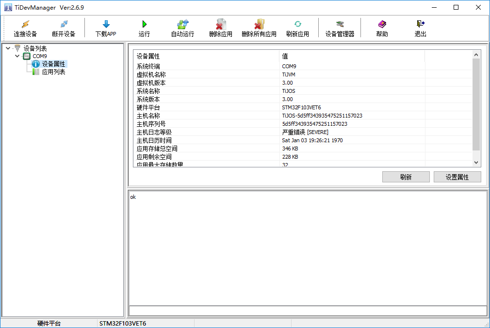
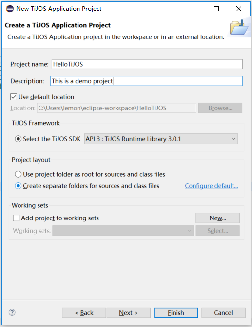
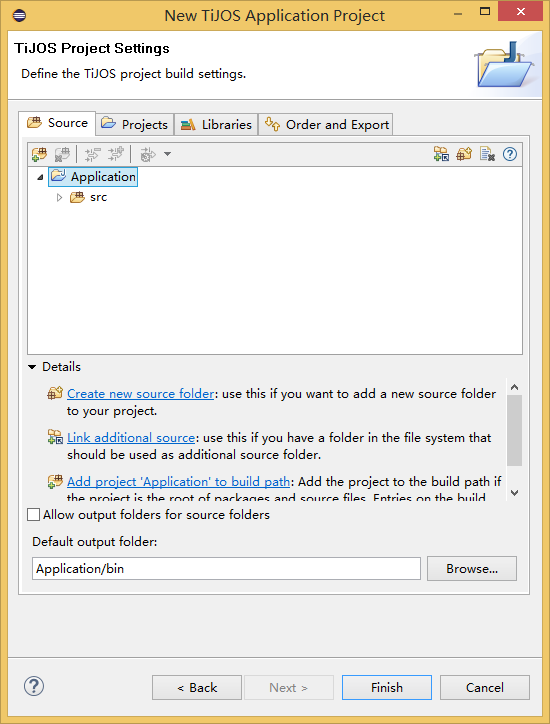

# 钛极OS(TiJOS)应用开发环境-TiStudio

## 概述

TiStudio是由钛云物联基于Eclipse开发的一款插件工具，通过此工具开发者可简单快捷的开发TiJOS应用。

### 主要功能

TiStudio提供如下功能:

​	创建TiJOS Application工程。

​	支持在线下载tapk应用至设备中。

​	获取并打印设备中输出的日志。

​	支持错误信息快速定位。

​	支持设备管理，快速添加设备至工具中。

​	支持在线安装方式，管理更方便。


## 安装

钛极OS(TiJOS)应用开发环境只需在Eclipse中在线安装TiStudio插件即可，安装成功后即可在Eclipse中进行TiJOS应用的开发和运行，Eclipse中TiStudio插件安装路径http://dev.tijos.net/studio/release, 按Eclipse标准插件安装流程进行安装即可。具体过程如下：

## 开发平台支持

最低要求：Windows 7及以上

## 安装Eclipse

TiJOS应用与标准Java 应用类似，通过在Eclipse中安装TiStudio插件即可通过Eclipse进行TiJOS应用的开发和调试，Eclipse可在http://www.eclipse.org/downloads/ 下载。

如果您已安装Eclipses, 可直接安装TiStuido即可。

Eclipse版本支持：4.6 及以上  （请选择Eclipse IDE for Java EE Developers 或 Eclipse IDE for Java Developers 版本)
Eclipse下载地址: http://www.eclipse.org/downloads/eclipse-packages/

## Eclipse使用小技巧
Eclipse 是一个开放源代码的、基于Java的可扩展开发平台。就其本身而言，它只是一个框架和一组服务，用于通过插件组件构建开发环境。
详细介绍链接如下：
https://baike.baidu.com/item/Eclipse/61703  

使用技巧链接如下：             
https://blog.csdn.net/tiantangdizhibuxiang/article/details/77256430                                                         
https://www.cnblogs.com/ning123/p/5954589.html

## TiStudio安装

在Eclipse中通过Help菜单下的"Install New Software" 安装TiStuido 插件, 安装过程如下:

1. 从Eclipse菜单"Help"下选择"Install New Software"

   

2. 从弹出的Install对话框中选择"Add"按钮后弹出“Add Repository"后，填写TiStudio的插件url http://dev.tijos.net/studio/release 名称任意

   

   Add Repository

   

   ```
   Name可以任意输入字符串， 请在Location中输入 http://dev.tijos.net/studio/release
   ```
   
3. 从显示出的"Available Software"中选择"TiJOS"下的"TiStudio Release"后， 点击"Next"按钮开始进行安装

   

4. 选择"I accept the terms of the license agreement" 后点击"Finish"即可完成安装

   

Installing...

   

## TiStudio 主要功能

### TiStudio 菜单

TiStudio安装完成后重新启动Eclipse之后，Eclipse的菜单中增加了"TiJOS"即为TiStuido相关功能


#### TiDevManager

运行TiDevManager设备管理器,  当需要对TiKit开发板进行设置时可通过该菜单项操作

#### Exception Query

异常查询， 如果用户应用中发生异常通过打印口或其它方式输出时，可使用该功能对异常进行分析和定位。

#### Development Kit 

快速导航到TiKit 开发套件在线文档，方便用户查看相关开发板帮助文档

#### Driver Store

快速导航到驱动中心网站， 方便用户获得相关驱动源码及例程

#### Samples

快速导航到方案及例程在线文档， 方便用户进行参考

#### Document Center

文档资源中心，可在线查看相关帮助文档


### TiDevManager设备管理器

通过TiJOS菜单下的TiDevManager 即可开启设备管理器, 连接TiKit开发板后， TiKit开发板相关信息即可自动显示在设备管理器中， 在TiDevManager可进行设备信息查看，运行日志查看，设备属性配置等功能 ，如果是网络应用，还可在TiDevManager中配置网络设置，如无线WIFI， 网关，DNS等等， 在开发过程中可根据需求连接相关的传感器进行开发和测试。

如果设备连接成功，在TiDevManager中可以看到当前连接的设备， TiStudio 使用检查到的第一个设备进行应用下载，运行测试。



### 新建TiJOS应用工程

在新建工程时选择“Other” 时， 即可看到TiJOS Application Project的选项

   


1. 在工程配置界面输入工程名称及描述并选择TiJOS SDK版本后点击Next按钮下一步进入Settings界面或者Finish按钮完成创建



1. 进入Settings界面

   

2. 如果可能用到钛极OS提供基本传感器驱动，如LED, BUTTON, OLED等，可通过Libraries选项加入“TiJOS Driver Library ClassPath Container", 也可在用到时通过Java Build Path 设置中加入也可，如下图所示

   

## 

当新建TiJOS Application Project后，即可在Eclipse中进行代码编写。

### 编译运行TiJOS应用

 完成编码后， 可在TiKit开发板上进行测试运行， 可右键选择"Run As  TiJOS Application" 在TiKit开发板上运行

   

### 查看应用日志

应用在运行时， 相应的日志会通过TiJOS LogCat 窗口输出


### 异常定位

代码运行中抛出异常信息并打印在TiJOS LogCat中，可直接在TiJOS LogCat点击异常信息定位至代码具体位置中。


如果Console中无法定位至代码中，也可通过点击菜单TiJOS --> Exception Query弹出异常查询窗口进行异常查询。在查询窗口中输入相关的错误编码并选择好工程后点击Query查询错误信息，点击Go跳转至具体具体源码位置中。


## 常见问题

1. 安装TiStudio时出现下图提示

   

   出现这种提示请直接勾选后点击“OK”即可。

2. 提示"Device manager startup failed"

   请检查Preferences中TiStudio配置路径是否正确。并尝试在菜单TiJOS --> TiDevManager来启动工具。

3. Run as --> TiJOS Application在线链接失败?

   在线链接功能需连接网络，请检查网络是否正常，或换个时间段再进行链接。

4. Run as --> TiJOS Application运行失败?

   请检查TiDevManager中设备是否连接成功, 可进行手动连接。

5. TiJOS LogCat不输出日志

   请检查TiDevManager中是否打开端口，打开端口后日志输出恢复正常。如仍无法正常输出日志，请尝试在TiDevManager中手动连接进行测试。

6. 提示tijos.framework.sensor 或 tijos.framework.transducer 不存在
   请在Java Build Path中的Library中加入“TiJOS Driver Library ClassPath Container"，如下图所示：
   

### 版本更新

当TiStudio 有新版本更新时也通过Eclipse提示并在线进行更新， 建议用户保持新版本。

## 总结

TiStudio 是进行钛极OS(TiJOS)应用开发的集成平台，也是一个标准Eclipse插件，与标准Java应用开发过程类似，只要熟悉Eclipse即可轻松上手TiJOS应用开发。