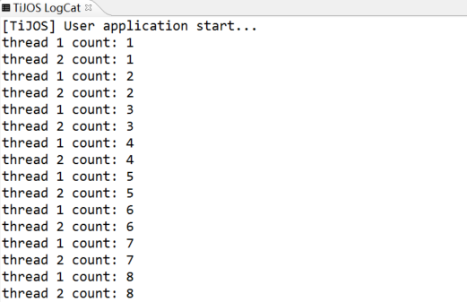
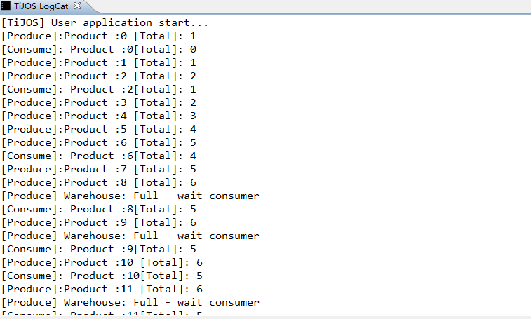

# 生产者与消费者-钛极OS(TiJOS)系统中的多线程

钛极OS(TiJOS)支持Java中标准的线程Thread和Runnable, 符合Java标准，线程可以大大简化许多类型的应用程序开发，但过度使用线程可能会影响程序的性能及其可维护性， 一般建议用在不阻塞整个程序的情况下执行阻塞I/O, 如等待网络数据等等。

钛极OS(TiJOS)中的线程与Java标准兼容， 因此只需参考Java中Thread 和Runable类编程方式即可快速应用。

## 线程优先极

建议所有线程使用默认优先级，否则有可能导致低优先级的线程没有机会执行。 

## 线程创建、启动

线程一般通过 Thread 构造器或实例化Thread的子类来创建并通过start()方法启动

```java
/** 
 * 扩展Thread类实现多线程程序
 */ 
public class CounterThread extends Thread{ 
	
     public CounterThread(String name) {
         super(name);
     } 

     public void run() {
    	 int i = 0;
         while(true)
         {
           i ++ ;
           System.out.println(this.getName() + " count: " + i);
           try {
                Thread.sleep(100);
            } catch (InterruptedException e) {
                e.printStackTrace(); 
            }
         }
     } 

     public static void main(String[] args) {
         Thread t1 = new CounterThread("thread 1");
         Thread t2 = new CounterThread("thread 2");
         t1.start(); 
         t2.start(); 
     } 
 }
```

输出结果：



源码请参考:[CounterThread.java](./src/CounterThread.java)

## 线程结束

run方法结束或有未捕获的异常发生后，线程也就结束了

## 经典生产者与消费者问题

生产者与消费者问题是线程同步里边一个很经典的问题， 用通俗的语言来描述

1. 一群生产者不断的生产产品，并将产品放到一个仓库里边；同时一群消费者不断从仓库里边消费产品
2. 仓库的容量是有限的。如果仓库满了，生产者不能再往仓库放产品，必须进入等待状态。等待产品被消费者拿走了，再往仓库放产品
3. 同样，如果仓库空了，消费者也必须进入等待状态, 等待生产者往里边放产品，再将消费者唤醒

在实际的软件开发过程中，经常会碰到如下场景：某个模块负责产生数据，这些数据由另一个模块来负责处理（是类、函数、线程、进程等), 产生数据的模块，就形象地称为生产者; 而处理数据的模块，就称为消费者, 数据保存的位置(缓存区， 文件等) 即为仓库， 仓库作为一个中介， 生产者把数据放入，而消费者从中取出.

## 解决方案

在Java中生产者与消费者的处理方式一般遵循如下原则:

|      | 生产者与消费者模型       | Java中的解决方法                            |
| ---- | --------------- | ------------------------------------- |
| 条件1  | 同一时间内只能有一个生产者生产 | 生产方法加锁sychronized                     |
| 条件2  | 同一时间内只能有一个消费者消费 | 消费方法加锁sychronized                     |
| 条件3  | 生产者生产的同时消费者不能消费 | 生产方法加锁sychronized                     |
| 条件4  | 消费者消费的同时生产者不能生产 | 消费方法加锁sychronized                     |
| 条件5  | 共享空间空时消费者不能继续消费 | 消费前循环判断是否为空，空的话将该线程wait，释放锁允许其他同步方法执行 |
| 条件6  | 共享空间满时生产者不能继续生产 | 生产前循环判断是否为满，满的话将该线程wait，释放锁允许其他同步方法执行 |

## TiJOS 例程代码

**产品类**, 用于表示需要处理的数据对象

```java
//产品
class Product
{
	private int id;
	
	Product(int id){
		this.id = id;
	}

	public String toString(){
		return "Product :" + id;
	}
}
```

**仓库类**, 用于存储生产出的产品，消费时从仓库取出，一般用集合实现， 此类中push为生产方法， 生产的产品通过该方法将产品放入仓库; pop为消费方法，从仓库中取出产品进行处理.

生产者线程和消费者线程共享同一个仓库，因此在访问仓库时需要同步。

```java
//产品仓库
class Warehouse
{
	Product productStore[] = new Product[6];
	int index = 0;
	
	/** 
	* 生产方法.
	* 该方法为同步方法，持有方法锁
	* 首先循环判断满否，满的话使该线程等待，释放同步方法锁，等待消费；
	* 当不满时首先唤醒正在等待的消费方法，但是也只能让其进入就绪状态，
	* 等生产结束释放同步方法锁后消费才能持有该锁进行消费
	* 
	* @param p 产品
	* @return  
	*/ 

	public synchronized void push(Product p){
		try{
			while(index == productStore.length){
				System.out.println("[Produce] Warehouse: Full - wait consumer");
				this.wait();
			}
			this.notify();
				
		}catch(InterruptedException e){
			e.printStackTrace();
		}catch(IllegalMonitorStateException e){
			e.printStackTrace();
		}	
		
		productStore[index] = p;
		index++;
		System.out.println("[Produce]:" + p + " [Total]: " + index);

	}

	/** 
	* 消费方法
	* 该方法为同步方法，持有方法锁
	* 首先循环判断空否，空的话使该线程等待，释放同步方法锁，允许生产；
	* 当不空时首先唤醒正在等待的生产方法，但是也只能让其进入就绪状态
	* 等消费结束释放同步方法锁后生产才能持有该锁进行生产
	* @return  
	*/ 
	public synchronized Product pop(){
		try{
			while(index == 0){
				System.out.println("[Consume] Warehouse: Empty - wait producer");
				this.wait();
			}
			this.notify();
			
		}catch(InterruptedException e){
			e.printStackTrace();
		}catch(IllegalMonitorStateException e){
			e.printStackTrace();
		}
		
		index--;
		System.out.println("[Consume]: " + productStore[index] + "[Total]: " + index);
		return productStore[index];
	}
}

```

**生产者线程**，负责产品的生产过程，将生产的产品放入到仓库中

```java
/**
 * 
 * 生产者线程
 *
 */
class ProducerTask implements Runnable
{
	Warehouse wh;
	ProducerTask(Warehouse w){
		this.wh = w;
	}

	//生产过程
	public void run(){
		for(int i = 0;i < 20;i++){
			Product m = new Product(i);
			wh.push(m);
			try{
				Thread.sleep((int)(Math.random()*500));
			}catch(InterruptedException e){
				e.printStackTrace();
			}
		}
	}
}
```

**消费者线程**， 负责产品的消费，将仓库中的产品取出

```java

/**
 * 
 * 消费者线程
 *
 */
class ConsumerTask implements Runnable
{
	Warehouse wh = null;
	ConsumerTask(Warehouse w){
		this.wh = w;
	}

	//消费过程
	public void run(){
		for(int i = 0;i < 20;i++){
			Product p = wh.pop();
			try{
				Thread.sleep((int)(Math.random()*1000));
			}catch(InterruptedException e){
				e.printStackTrace();
			}
		}
	}
}
```

主程序， 启动生产者和消费者线程进行并行处理

```java
//生产者-消费者
class  ProducerConsumer
{
	public static void main(String[] args) 
	{
		Warehouse w = new Warehouse();
		ProducerTask p = new ProducerTask(w);
		ConsumerTask c = new ConsumerTask(w);
		Thread tp = new Thread(p);
		Thread tc = new Thread(c);
		tp.start();
		tc.start();
	}
}

```

编译下载后，在TiKit上的运行结果如下：



相关源码请参考[ProducerConsumer.java](./src/ProducerConsumer.java)