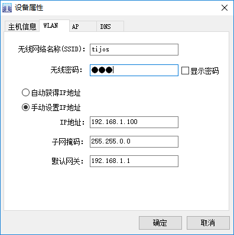

#  与世界连接-网络操作之TCP Client

钛极OS(TiJOS)支持标准Java的Socket类， 编程方法与标准Java一样， 可参考相关例程， 下面以一个tcp client的例程说明如何在钛极OS(TiJOS)中通过TCP连接网络中的服务器。

下面以TiKit-T600-ESP8266A作为平台介绍如何在钛极OS(TiJOS)中进行网络开发.

## 网络配置

在进行网络编程之前，需要首先通过TiDevManager对TiKit进行网络设置，包括WLAN, IP, DNS等等




## 创建工程

通过TiStudio创建TcpClient工程及TcpClient类


## 启动网络连接

在进行网络相关的编程之前, 首先需要在代码中启动网络连接, 启动后TiKit会去连接设置的无线路由,如果

```java
try
{
  //启动连接WLAN, 10秒超时
  //WLAN的设置可通过TiDevManager配置
  TiWiFi.getInstance().startup(10);

  //启动DNS
  TiDNS.getInstance().startup();
}
catch(IOException ex)
{
  //网络连接失败
  ex.printStackTrace();
  return ;
}
```


## 连接服务器

网络连接成功后，可通过创建socket的方式连接指定服务器，在测试时可先启动一个 TCP Server测试工具

```java
//TCP服务器IP及PORT
String host = "192.168.1.55";
int port = 8080;
Socket client = null;

//Connect to the server with TCP 
client = new Socket(host, port);
	
```


## 数据发送接收

连接成功后，即可进行数据的发送和接收操作，通过socket的getInputStream和getOutputStream获取相应的stream进行数据读写操作即可， 注意，在写操作时，如果确认数据已写完，需要调用flush来即时将数据发送到服务器。

```java

OutputStream  output = client.getOutputStream();
		
//Send data to the TCP server
output.write("Hello, this is client".getBytes());
output.flush();
			
//Get remote data from the server
InputStream input = client.getInputStream();
			
byte[] buffer = new byte[1024];
while (true) {
		int len = -1;
		len = input.read(buffer);
				
		if(len > 0)
		{
			System.out.println("message form server:" + new String(buffer, 0, len));
			//echo to the server
			output.write(buffer, 0, len);
			output.flush();
		}
}
```


## 关闭

在应用结束，请关闭socket以释放资源，一般在finally中通过close函数来完成。

```java
finally
{
	try {
			client.close();
		} catch (IOException e) {}
}
```

## 结论

以上即为在钛极OS(TiJOS)中进行网络编程的一般流程，与标准Java类似， 不同的是需要在使用网络前需要启动相应的网络连接。

相应的例程源码请参考[TcpClient.java](./src/TcpClient.java)