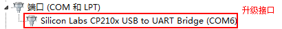
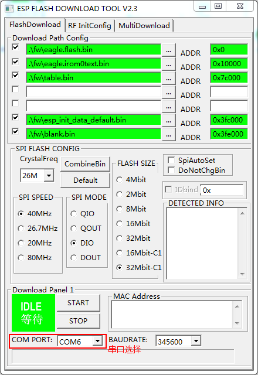
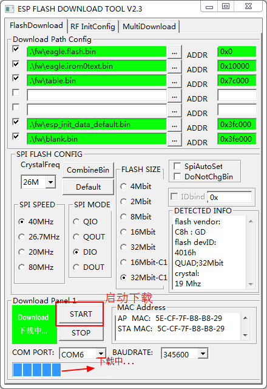
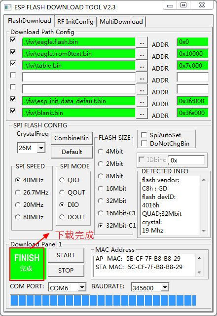
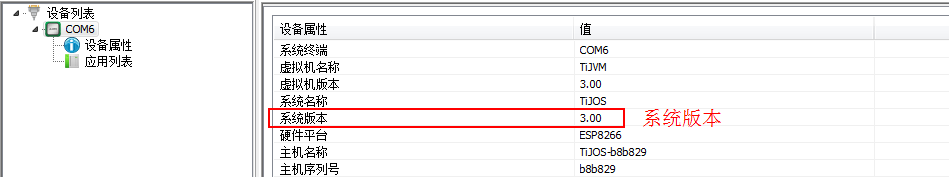

# 钛极OS(TiJOS)系统固件(TiKit-T600-ESP8266)升级方法

## 注意事项

1. 本固件升级工具中下载配置部分用户不需要更改。
2. 升级前请务必确认您使用的开发板型号与升级包匹配。
3. 若用户使用的是**非官方版本**开发板，请确认使用ESP-12E/F/N/S (32Mbit存储容量FLASH) 型号的模块。

## 适用开发板

TiKit-T600-ESP8266系列。

## 更新流程

### 下载最新固件包

[tijos-fw-tikit-t600-esp8266_3.00.zip](./package/tijos-fw-tikit-t600-esp8266_3.00.zip)

如果需要下载历史版本, 请点击[下载其它版本](#固件历史版本)

### 连接开发板

1. 去掉开发板**底板**上的UART接口上的外设（此接口与固件升级接口复用，故需要提前让出接口）。

2. 连接开发板**顶板**USB到计算机。

   
   用户可通过计算机设备管理器查看升级接口识别情况，出现如上图片内容说明系统已经识别，**请记住当前串口号，如：COM6，后续将用到**。

3. 在运行下载工具前, 请从右下角手动退出TiDevManager

4. 复位开发板，按动一次开发板上的**RESET按钮**，**这步操作很重要，否则后续操作无法正确执行**！

   ​

### 启动下载工具

双击启动“ESP_DOWNLOAD_TOOL_V2.3.exe”工具。

### 选择下载串口

工具启动后，界面如下图所示，用户只需要在“COM PORT”选项中选择有效的COM口即可，这里使用COM6。

### 启动固件下载

1. **按住**开发板**顶板**的FLASH按钮不松开，按一下**底板**上的RESET按钮，然后松开FLASH按钮。

2. 点击工具上的“START”按钮，固件开始下载，如下图所示。

   **注1：如果出现下载未能启动或下载失败的情况，可以多尝试几次。**

   **注2: 下载前请确保TiDevManager已退出(可从Windows右下角通过右键退出)**

等待约20秒左右，固件下载完成，如下图所示。

下载成功后，用户按一次开发板底板RESET按钮，至此固件升级结束。

### 查看系统信息

固件下载完成后，需要使用TiDevManager设备管理工具连接开发板，查看设备属性。

固件升级包文件名称中包含了该固件版本号，如tijos-fw-tikit-t600-esp8266_3.00.zip为固件版本号为3.00,

通过比较设备属性的系统版本和固件升级目录系统版本，可以判断固件升级成功。

**注：此固件升级教程以3.00固件版本为例，用户需根据实际升级版本来判断。**

## 固件历史版本

[tijos-fw-tikit-t600-esp8266_2.06.zip](./package/tijos-fw-tikit-t600-esp8266_2.06.zip)