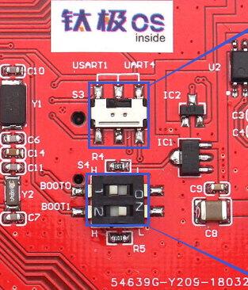
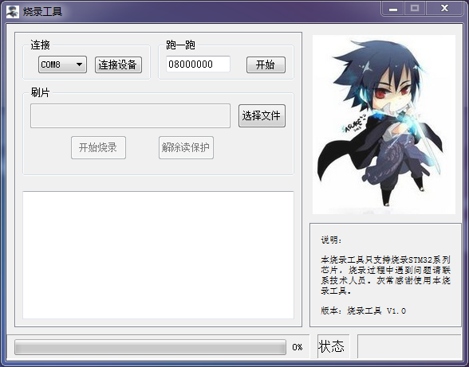

# 钛极OS(TiJOS)系统固件(TiKit-T800-STM32F103)升级方法

## 注意事项

1. 本固件升级工具由第三方提供，下载配置部分用户不需要更改。
2. 升级前请务必确认您使用的开发板型号与升级包匹配。
3. 若用户使用的是**非官方版本**开发板，请确认MCU芯片型号为：STM32F103VET6。

## 适用开发板

TiKit-T800-STM32F103系列。

## 更新流程

### 下载最新固件包

[tijos-fw-tikit-t800-stm32f103_3.00.zip](./package/tijos-fw-tikit-t800-stm32f103_3.00.zip)

如果需要下载历史版本, 请点击[下载其它版本](#固件历史版本)

### 连接开发板

1. 将开发板上S3开关拨至USART1位置(左侧)，将拨码开关S4的1位置开关拨至H位置(左侧)，如下图所示：

   

2. 连接开发板USB到计算机。

   
   用户可通过计算机设备管理器查看升级接口识别情况，出现如上图片内容说明系统已经识别，**请记住当前串口号，如：COM8，后续将用到**。

3. 在运行下载工具前, 请从右下角手动退出TiDevManager。

4. 复位开发板，按动一次开发板上的**RESET按钮**，**这步操作很重要，否则后续操作无法正确执行**！
  ​

### 启动下载工具

如下图，双击启动“STM32_ISP_Programer.exe”工具。

### 选择并连接下载串口

工具启动后，界面如下图所示，用户只需要在“连接”选项中选择有效的COM口即可，这里使用COM8，然后点击“连接设备”按钮，连接成功后工具会提示，如下图，若连接失败，需要重新复位开发板，再次点击“连接设备”按钮。

### 启动固件下载

1. 选择目标固件版本文件程序，文件路径：tijos-fw-tikit-t800-stm32f103_3.00/fw/
2. 固件文件名称：tijos-fw-tikit-t800-stm32f103_3.00.hex。
3. 点击工具上的“开始烧录”按钮，固件开始下载，如下图所示。

等待约30秒左右，固件下载完成，如下图所示。

3. 下载成功后，需要将开发板上S3开关拨至UART4位置(右侧)，将拨码开关S4的1位置开关拨至L位置(右侧)。
4. 复位开发板，至此固件升级结束。

### 查看系统信息

固件下载完成后，需要使用TiDevManager设备管理工具连接开发板，查看设备属性。

固件升级包文件名称中包含了该固件版本号，如tijos-fw-tikit-t800-stm32f103_3.00.zip为固件版本号为3.00,

通过比较设备属性的系统版本和固件升级目录系统版本，可以判断固件升级成功。

**注：此固件升级教程以3.00固件版本为例，用户需根据实际升级版本来判断。**

## 固件历史版本

